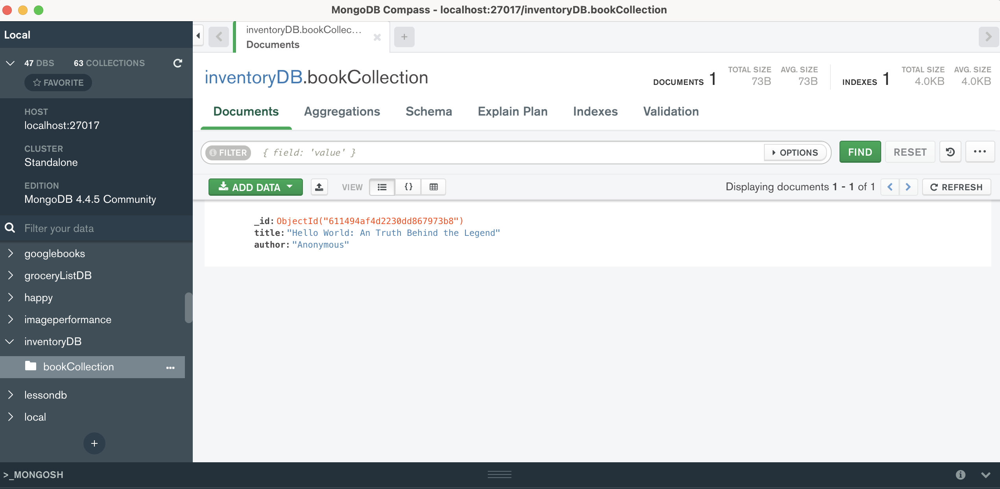

# 📖 Create and View Data Using MongoDB Compass

Work with a partner to implement the following user story:

* As a developer, I want to create a MongoDB database to store data.

* As a developer, I want to add a collection to my database and insert a document so that I can visually explore that data using MongoDB Compass.

## Acceptance Criteria

* It is done when I click the Connect button to navigate to the Compass home page.

> Note: You do not have to paste a connection string before clicking Connect.

* It is done when I have created a new local database named `inventoryDB` using Compass's Embedded MongoDB Shell (MongoSH).

* It is done when I have added a new collection named `bookCollection`, inserted a field called `title`, and provided a value for the `title` field.

* It is done when I refresh the page and the `inventoryDB` appears on the list of databases.

* It is done when I open the `bookCollection` collection and the document I just created is visible on the Documents tab and an `_id` field has been automatically inserted.

* It is done when I have modified the existing document, added a new field called `author`, and provided a value for the `author` field.

## 📝 Notes

Refer to the documentation:

[MongoDB Compass docs on Connect to MongoDB](https://docs.mongodb.com/compass/current/connect/)

[MongoDB Compass docs on Embedded MongoDB Shell](https://docs.mongodb.com/compass/current/embedded-shell/)

[MongoDB docs on Creating a MongoDB Database with the CLI (the MongoDB shell)](https://www.mongodb.com/basics/create-database)

[MongoDB docs on MongoDB CRUD Operations](https://docs.mongodb.com/manual/crud/)

[MongoDB Compass docs on View Documents](https://docs.mongodb.com/compass/current/documents/view/)

[MongoDB Compass docs on Modify Documents](https://docs.mongodb.com/compass/current/documents/modify/)

## Assets

The following image demonstrates the web application's appearance and functionality:

---

## 💡 Hints

* What shell command do you use to create a new database?

## 🏆 Bonus

If you have completed this activity, work through the following challenge with your partner to further your knowledge:

* How can you perform create, insert, and delete operations in bulk using MongoDB? When would this be useful?

Use [Google](https://www.google.com) or another search engine to research this.

---
© 2022 Trilogy Education Services, LLC, a 2U, Inc. brand. Confidential and Proprietary. All Rights Reserved.
