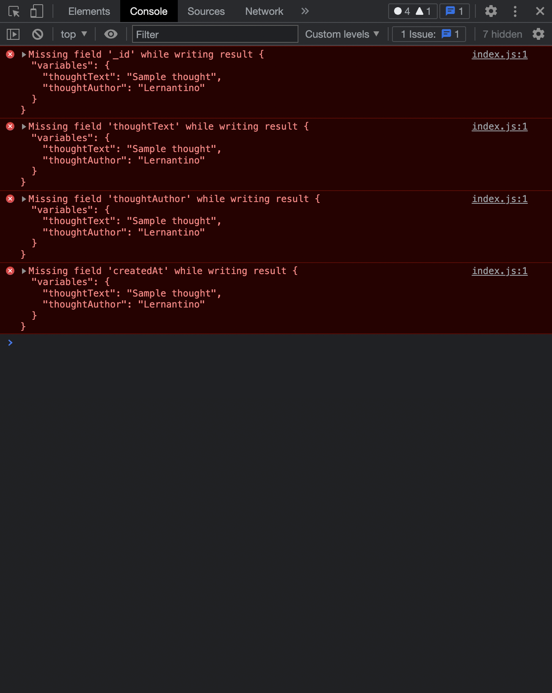

# 🐛 Apollo Client Cache Update Throws an Error

Work with a partner to resolve the following issue:

* As a user, when I submit a new thought, I want that thought to be displayed on the page without reloading it.

## Expected Behavior

When as user submits a new thought through the form, the thought should be automatically added to the page without refreshing the page.

## Actual Behavior

When a user submits a new thought through the form, the thought is created but the cache update functionality throws an error in the console and doesn't update correctly.

## Steps to Reproduce the Problem

  To reproduce the problem, follow these steps:

1. Run `npm install` and `npm run develop` from the command line at the root of the application's directory.

2. Navigate to `http://localhost:3000` in the browser.

3. Fill out the form at the top of the page and submit the form to see the error.

## Assets

The following image shows the error:

---

## 💡 Hint

* Where does the cache update functionality go when executing a mutation?  

## 🏆 Bonus

If you have completed this activity, work through the following challenge with your partner to further your knowledge:

* What is another means of storing data globally client-side that we can implement?

Use [Google](https://www.google.com) or another search engine to research this.

---
© 2022 edX Boot Camps LLC. Confidential and Proprietary. All Rights Reserved.
