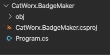
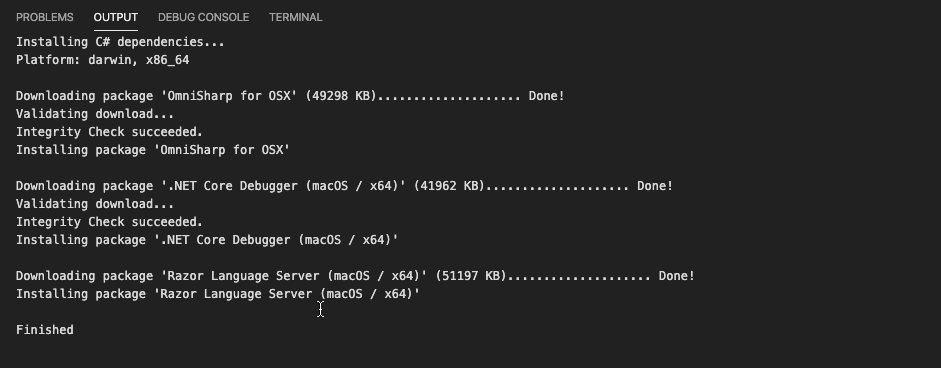
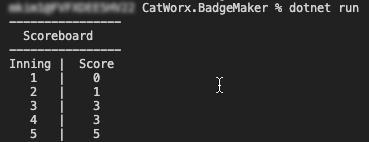
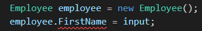
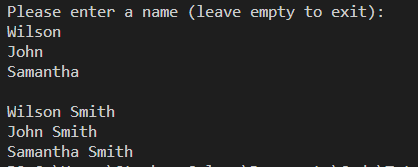
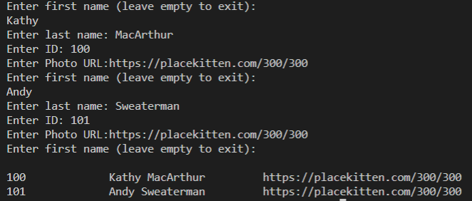
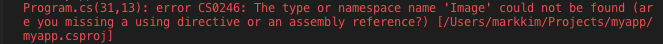

# Part 1: Get Started

## Introduction

In this unit, you’ll use C# to create a console app that creates security badges for your rapidly expanding startup, CatWorx. You’ll use the .NET framework to import libraries that allow you to read and write to the filesystem, query APIs, and generate images. 

Before we get started, we need to set up an environment that can build and run C# applications. We’ll use VS Code, which you should already have set up from working with JavaScript. 

Because you already have VS Code installed, it’s just a two-step process to enable it to write, debug, and build C# projects. Let’s get started!

# Lesson 1: Set Up the C# Environment

In order to set up VS Code to program in C#, you simply need to add a C# extension and install .NET Core. 

## Add the C# Extension

First, let’s add the C# extension:

1. In VS Code, go to Extensions by clicking the Extensions icon in the menu on the left.

2. Search for C#.

3. Add the C# extension by OmniSharp. It should be near the top of the list.  

For Macs, extensions can be found in View > Extension.


## Install .NET Core

Next we’ll install the .NET Core SDK from Microsoft. This package will install everything we need to build and run C# applications: libraries, tools, and the .NET runtime environment. The .NET runtime environment includes the dotnet application, which will allow us to install extra packages (called "assemblies"), and run our C# applications from the terminal. It's like Node's npm.

**📝 **The .NET Core SDK is not specific to VS Code and can be used with other source code editors. 

For more information about `dotnet`, visit the [dotnet command Microsoft documentation](https://docs.microsoft.com/en-us/dotnet/core/tools/dotnet).

To install the .NET Core SDK:

1. In a web browser, go to [.NET Core Guide | Microsoft Docs](https://docs.microsoft.com/en-us/dotnet/core/).

2. Locate the **Install .NET Core** section. In the **DOWNLOAD** section, click on the **.NET Core downloads** link.

3. This will navigate you to a new page with the heading, **Download .NET Core**. Select the (recommended) version with the status LTS, or Long-Term Support.

4. This will navigate you to a new page with the heading, **Download .NET Core X.X**, with the version number matching the LTS version that was selected. Click on the link **See recommended downloads for the latest version of .NET**.

5. This will bring you to a new page with the heading, **Download .NET**. Select the link, **Download .NET Core SDK**, shown in the following image:


6. This will bring you to a new page with the heading, **Thanks for downloading ...**. A modal with input fields will request the download location for the new file. Once the file has been downloaded, open it to install...

Let’s confirm that our C# environment was installed and will now enable us to build C# projects. Open a new terminal and type `dotnet --info`. You should see output similar to below:

```bash
$ dotnet --info
.NET Core SDK (reflecting any global.json):
 Version:   2.2.106
 Commit:    aa79b139a8

Runtime Environment:
 OS Name:     Mac OS X
 OS Version:  10.14
.
.
.
```

If you get an error like "command not found," you may need to manually add a link to dotnet in your executable path. See [this GitHub issue](https://github.com/dotnet/cli/issues/2544) for more details.

# Lesson 2: Hello, World!

How could we embark on learning a new programming language without creating a "Hello, World!" application? We'll initialize a new C# project using the dotnet executable, which creates a "Hello World!" app for us!

Let's navigate to the folder where you want your project to reside. At the command prompt, use dotnet to create a new console app called `CatWorx.BadgeMaker`.

```bash
$ dotnet new console -o CatWorx.BadgeMaker
```

This command will create a new folder called `CatWorx.BadgeMaker` that will contain your C# project. In VS Code, select File from the main menu bar, and choose "Open Folder…" Navigate to the `CatWorx.BadgeMaker` folder that dotnet created. Double-click `CatWorx.BadgeMaker` to open it in the VS Code explorer pane.

As you can see, there are already some files and folders in the project:



Let’s take a look at these:

* The `obj` folders are used by .NET Core to execute the C# code. 

* The `CatWorx.BadgeMaker.csproj` file is very similar to a package.json file that contains your program's dependencies and packages.

We will now take a look at the `Program.cs` file, which where we will develop the console application.
Notice that when this file is opened, if you have your integrated terminal open as well, you wil see a series of dependencies install in the OUTPUT tab that will look similar to the following image:



Let’s take a look in the `Program.cs` file:

```c#
using System;

namespace CatWorx.BadgeMaker
{
  class Program
  {
    static void Main(string[] args)
    {
      Console.WriteLine("Hello, World!");
    }
  }
}
```

To run the app, navigate to the `Catworx.BadgeMaker` folder in the terminal, then enter the command `dotnet run`.

The output should read "Hello, World!". Congrats—you are now a C# developer!

Next, let’s take a deeper dive into our C# app to understand how it works.

## Namespaces

Next, you will notice the keyword namespace followed by the name of the app, `CatWorx.BadgeMaker`. Namespaces in C# are used to organize and provide a level of separation in the code—something like modules in Node.js. 

Namespaces can be thought of as containers that have members. A member can be another nested namespace, a method, or a class (as it is in this case).

* Following namespace `CatWorx.BadgeMaker`, everything inside the curly braces can be interpreted as members of that namespace.

* **Note:** Common conventions normally use a company name for the root namespace to ensure it is unique.

* On the very first line, we are importing a common namespace called `System`.

* The using Directive

The first line in the program is using `System`;.

Much like `require` or `import` when using modules in Node.js, in C# the using directive lets you use the corresponding namespace `System` without needing to qualify its use when using one of its members. For example, without this naming shortcut, every time Console is used, it would need to be proceeded with `System` and a period. 

The `System` namespace is part of the .NET framework and is a collection of commonly used methods, data types, and data structures as well as much more. These are the essential building blocks of a C# application.

To learn more, check out [Microsoft’s documentation on System Namespace](https://docs.microsoft.com/en-us/dotnet/api/system?view=netframework-4.8).

## The Main Method

Within the namespace will be a class named Program and a static method named Main. We will go into further details about classes in C# a bit later in this tutorial, but for now we will take a closer look at the Main method in Program.

Main is a very special method that serves as the entry point of the application. It is the method that is invoked when the program runs and where we will be placing our code. 


Main must have a specific syntax in order to be recognized as the program's entry point:

* Main must be nested in a class.

* There can only be one entry point to a program.

* The keyword void signifies that the return of this executable method will be void.

* The keyword static implies that the scope of this method is at the class level, not the object level, and can thus be invoked without the need to first create a new class instance. Hence the Main method is available to run as soon as the program runs. 

We would use the following syntax to initialize our Main method, with or without parameters: 

```c#
static void Main () //Entry Point
```

or

```c#
static void Main (string[] args) //Entry Point
```

Now that we have a basic understanding of how a program is set up, let’s explore how to build our own. First let’s explore C#’s built-in data types.

## Data Types

Like JavaScript, C# has various data types that can store values, each with their own set of properties and unique behavior. The main distinction, however, is that C# is a statically typed language. This means that the data type is explicitly labeled when a variable is declared. Whereas in JavaScript, declaring a variable with the keyword var allowed the data type to be inferred, C# variables **must** be declared with a data type as shown in the following code block. 

```js
// JavaScript
var carModel = "Explorer";
var carPrice = 500;
```

```c#
// C#
string carModel = "Intrepid";
int carPrice = 500;
```

In the preceding code block for C#, notice the `carModel` was declared as a `string` and the `carPrice` was declared as `int` which is an integer. The advantage of a statically typed language is the added stability and potential error catching done automatically by the compiler. 


## Strings

Just as in JavaScript, C# strings store plain text. Let’s explore strings by doing a little coding. In this section, you will type some code examples in `Program.cs` and then run the app using dotnet run to see the output printed in the console. 

Type the following code inside the Main method and try to guess what the outcome will be before executing the program. Notice how the variable greeting is declared as a string data type.

```c#
string greeting = "Hello";
greeting = greeting + "World";
Console.WriteLine("greeting" + greeting);
```

**Hint:** Unlike JavaScript, double quotes **must** be used for strings in C#. 

If you decided to copy and paste the code into VS Code, you will notice syntax errors. All the double quotes may need to be replaced by double quotes in VS Code due to incorrect character interpretation.

## String Interpolation

Alternatively, there are a few other ways to print variables in C#. You might recognize some similarities to JavaScript in the following code example:

```c#
Console.WriteLine($"greeting {greeting}"); 
Console.WriteLine("greeting: {0}", greeting);
```

In the preceding code block, the first statement interpolates the variable `greeting` with the use of the `$` and curly braces surround the variable, `{greeting}`.
The second statement interpolates the variable, `greeting`, by associating the zero index with the second argument of the function call.

## Numbers

Just like JavaScript, number data types are used to store numbers. They have unique properties inherent to the number data type. 

For example, integer values and decimal values have different data types in C#, as is the case in virtually all programming languages. Can you guess which is which in C#? That’s right—`int` and `float`.

For an extensive summary of the variety of data types and their uses, take a look at the [official documentation on data types created by Microsoft, the maintainers of C#.](https://docs.microsoft.com/en-us/dotnet/csharp/language-reference/builtin-types/built-in-types) 

Now's let try an exercise to find out how to solve some basic math operations in C#.
Try to solve the following problem by writing a solution in the `Main()` of the `Program.cs`.

```c#
// How do you find the area of a square?  Area = side * side
float side = 3.14;
```

Try to compute the solution programatically by placing the code in the `Main()` function and replace the "Hello World!" statement in the `Program.cs` file. Then run the program with `dotnet run`.

Here are some questions to consider in case you get an error or get stuck. 

* Do we need to declare the `area` as a variable?

* What data type should `area` be?

* What does the error suggest?

`float` is actually a very special data type with a little bit different syntax. 

The error we receive in the console is due to the data type mismatch in the operation. Reading the message not only points out the mistake, but also offers a solution-to use the `double` data type.

When trying to use the Math library, `double` usage is explicitly stated in the parameters, as you can see in the following code example:

```c#
double side = 3.14;
double area = side * side;
Console.WriteLine("area: {0}", area);
```

How do we identify the data type of a variable?

We use the `GetType()` function.

```c#
Console.WriteLine("area is a {0}", area.GetType());
```

## Math Operators

Try to guess what the outcomes will be for the following lines of code, then run them in your Main method:

```c#
Console.WriteLine(2 * 3);         // Basic Arithmetic: +, -, /, *
Console.WriteLine(10 % 3);        // Modulus Op => remainder of 10/3
Console.WriteLine(1 + 2 * 3);     // order of operations
Console.WriteLine(10 / 3.0);      // int's and doubles
Console.WriteLine(10 / 3);        // int's 
Console.WriteLine("12" + "3");    // What happens here?

int num = 10;
num += 100;
Console.WriteLine(num);
num ++;
Console.WriteLine(num);
```

As we can see from the results we received in the console, the math operations perform as expected. Strings concatenate and the math operators abide by math rules when it comes to the operation order.

## Booleans

C# also has a separate Boolean type, `bool`. We can declare any variable as a type `bool` and assign the variable a `true` or `false` value as seen in the following declaration.

```c#
bool isCold = true;
Console.WriteLine(isCold ? "drink" : "add ice");  // output: drink
Console.WriteLine(!isCold ? "drink" : "add ice");  // output: add ice
```

Run the preceding statements in the `Main()` function in the `Program.cs` file. 

## Data Type Conversions

In JavaScript, there was often a need to convert data types. Let’s do this in C#.

Imagine that you are given the string, `stringNum = "2"`. In order use `stringNum` in a math operation, we need to do a data type conversion to a number.

Try your hand at writing code that converts the `stringNum` text to an `Int32` and stores it into a variable. Print the variable and print the variable's type, as well.

**Hint:** Use the `Convert` class from the `System` namespace, specifically the `ToInt16()` method.

**Hint:** Use `GetType()`.

When you're finished, your work should match or be very similar to the following code:

```c#
string stringNum = "2";
int intNum = Convert.ToInt16(stringNum);
Console.WriteLine(intNum);
Console.WriteLine(intNum.GetType());
```

**Important:** `Int16` designates the storage available for the variable. This calculates to 16 bits which is 2^16 or 65,536 values, which is normally enough for daily computation. There are also Int32 and Int 64 for larger calculations when necessary. 

Now let’s move on to some more complex data structures that will allow us to start building our application.

## Data Structures

In this section, we will look at the following C# data structures:

* Dictionaries

* Arrays

* Lists

These more complex data types allow us to store lots of data in a structured format. Similar to how JavaScript used arrays and object literals, C# uses these data structures to maintain large sets of data with different accessobility operations. The choosing the "right" data structure for the job will optimize performance for the application.

### Dictionaries

Similar to object literals in JavaScript, dictionaries in C# use a key-value pair relationship. But just as with the data types, the type of data that can be stored must be explicitly stated when the data structure is declared. 

The following code example demonstrates how to implement a `Dictionary` in C#. 

To use a `Dictionary`, you must first import `System.Collections.Generic` at the top of the `Program.cs` file.

```c#
using System.Collections.Generic;
```

Data types for a Dictionary's key-value pair types are declared in angled brackets as shown in the following examples: 

```c#
<string, double>
<int, string> 
```

In the following code example, we are declaring that the variable, `myScoreBoard`, is a `Dictionary` that has a string key and an integer value:

```c#
Dictionary<string, int> myScoreBoard = new Dictionary<string, int>();
```

To populate the `Dictionary`, we use the `.Add()` method in multiple lines to add data.

```c#
myScoreBoard.Add("firstInning", 10);
myScoreBoard.Add("secondInning", 20);
myScoreBoard.Add("thirdInning", 30);
myScoreBoard.Add("fourthInning", 40);
myScoreBoard.Add("fifthInning", 50);
``` 

Alternatively, we could initialize the `Dictionary` by listing the key-value pairs in a function call. Using this method, we pass a comma-separated list of key-value pairs in braces, `{}`, for each entry we wish to create:

```c#
Dictionary<string, int> myScoreBoard = new Dictionary<string, int>(){
    { "firstInning", 10 },
    { "secondInning", 20},
    { "thirdInning", 30},
    { "fourthInning", 40},
    { "fifthInning", 50}
};
```

This is functionally equivalent to the first method. 

Use one of the patterns above to populate `Dictionary`, `myScoreboard`, and then add the following code block, to print the `Dictionary`:

```c#
Console.WriteLine("----------------");
Console.WriteLine("  Scoreboard");
Console.WriteLine("----------------");
Console.WriteLine("Inning |  Score");
Console.WriteLine("   1   |    {0}", myScoreBoard["firstInning"]);
Console.WriteLine("   2   |    {0}", myScoreBoard["secondInning"]);
Console.WriteLine("   3   |    {0}", myScoreBoard["thirdInning"]);
Console.WriteLine("   4   |    {0}", myScoreBoard["fourthInning"]);
Console.WriteLine("   5   |    {0}", myScoreBoard["fifthInning"]);
```

Now run the code in the console with the terminal command `dotnet run`. You should receive the following display in the console:



### Arrays

Similar to JavaScript, arrays are data structures that can store large amounts of data with similar accessibility features. As you will recall, items in arrays can be accessed by their index, which starts at 0. 

However, there are a couple of notable distinctions in the way C# handles arrays. These are due to the fact that the **data type** of the array’s elements must be declared—just as we did for variables in C#. This constraint allows for only a single data type to be contained in the array. 

Another distinction is that the **length** of the array must also be set when the array is declared. No new elements can be added or subtracted from the array.

To declare an array in C#, we must declare the data type and size as shown in the following code block:

```c#
string[] favFoods = new string[3]{ "pizza", "doughnuts", "icecream" };
string firstFood = favFoods[0];
string secondFood = favFoods[1];
string thirdFood = favFoods[2];
Console.WriteLine("I like {0}, {1}, and {2}", firstFood, secondFood, thirdFood);
```

Remove any prior code in the `Main()` function and replace the preceding code.

Run the code from the terminal with `dotnet run`.

You should see the following output to the console:

```bash
I like pizza, doughnuts, and icecream
```

Just as in JavaScript, we can access the array using `[]` and the array's index.

### Lists

Now let's turn to lists in C#. Lists might seem more similar to arrays in JavaScript because their lengths are not static; they can expand to contain all the elements needed.

Like dictionaries, lists are located in the `System.Collections.Generic` namespace. Therefore be sure to import this directive with the `using` statement at the top of the `Program.cs` file:

```c#
using System.Collections.Generic;
```

The following code block demonstrated how to declare a `List` and its data types using the angle bracket notation, similar to the `Dictionary`. We also added more employee names using the `Add()` method.

```c#
List<string> employees = new List<string>() { "adam", "amy" };

employees.Add("barbara");
employees.Add("billy");
```

Now that the `List` is populated with employee data, how can we access our employees list to print the employee names to the console?

**Hint:** Leverage your knowledge of JavaScript arrays.

```c#
Console.WriteLine("My employees include {0}, {1}, {2}, {3}", employees[0], employees[1], employees[2], employees[3]);
```

We used the same bracket notation, `[]`, we used with arrays. 

Can you predict what the output will look like here?

Let's add this code to the `Main()` function and run the application to verify our prediction.
We should get the following response in the terminal:

```bash
My employees include adam, amy, barbara, billy
```

Simple, but redundant, how can we keep our code DRY? Imagine a huge company that needed to create an employee list, this would take forever. Is there a process we used in JavaScript that led to a much more automated process to print array elements? 

If you guessed loops you were correct!

## Loops

Time to put your googling skills to work! See if you can find the correct function to iterate through the employees list.

If you came up with `for` loops, you’re right! Just like in JavaScript, `for` loops can be used in C# to iterate through an array or (in our case) a list.

**Hint:** Google #1 search term for c# for loop is [here](https://www.tutorialsteacher.com/csharp/csharp-for-loop)[.](https://www.tutorialsteacher.com/csharp/csharp-for-loop)

Can you note all the differences and similarities from Javascript?

Replace the `Console.Writeline()` statement currently in the `Main()` function with the following code block and run the application:

```c#
for (int i = 0; i < employees.Count; i++) 
{
  Console.WriteLine(employees[i]);
}
```

In the console, we are able to display each employee's name on a separate line:

```bash
adam
amy
barbara
billy
```

We will use a `List` to store the employee names for our Badge Maker application since the `List` can grow to accomodate the size of our company as well as have a familiar interface to access and populate data into the `List`.

## Let’s Review

We covered a lot of topics in this unit so far, including many of the fundamental differences between C# and JavaScript. 

In this lesson, you learned:

* How to set up a C# environment

* How to run a C# application

* How to declare a statically typed variable

* Data types in C#

  * Strings

  * Numbers

  * Arrays vs. lists

  * Dictionaries

  * Booleans

* Iteration

  * for loops

  * foreach

With these essential building blocks under you belt, you can continue on to build a security badge application and learn more about the utilitarian nature of the C# language as well as the .NET framework.

That is a lot to cover in a short amount of time, but by leveraging your knowledge of OOP from JavaScript, you are well ahead of the curve. At this point, the expectation will be to understand some of what makes C# unique and get used to using C#’s assets to build simple programs.

Now that you have a basic understanding of the C# syntax, let’s move on and learn how to interact with the user through the console.

Part 2: Create the Employee Entity

## Intro

Now that we have our development environment set up, we're ready to build our badge-making app. We’ll build on the foundation of C# fundamentals covered in Step 1 as we learn how to:

* Interact with users via the command-line interface (CLI)

* Declare and call class methods

* Create and instantiate a new class

* Refactor our code along the way to keep our project organized, maintainable, and extensible

By the end of this step, our app will be able to accept information about multiple employees from the user, and print it all out to the CLI. It will also have a well-defined entity for employees in the form of a new `Employee` class.

## Get a single employee name from the user with ReadLine()

In Part 1, we hard coded employee names to get familiar with coding C#. In the real world, our employee names and other information will come from outside the application.

It would be cumbersome to update this list every time the company hires a new employee. Fortunately, Console has a method that allows us to read input from the command line and assign it to a variable. Let’s try this out by updating the Main() method to ask the user for an employee name, and then immediately display it.


```c#
using System;
using System.Collections.Generic;

namespace CatWorx.BadgeMaker
{
  class Program
  {
    static void Main(string[] args)
    {
      List<string> employees = new List<string>() { "adam", "amy" };
      employees.Add("barbara");
      employees.Add("billy");
      Console.WriteLine("Please enter a name: ");
      // Get a name from the console and assign it to a variable
      string input = Console.ReadLine();
      employees.Add(input);
      for (int i = 0; i < employees.Count; i++) 
      {
        Console.WriteLine(employees[i]);
      }
    }
  }
}
```

Run the program in the VS Code terminal by typing dotnet run. After typing in a name and pressing Enter, you should see that name added to the printed list. Note that the .NET runtime halts when it encounters `Console.ReadLine()` and waits for input. It then continues executing on the next line. 

Now that we have an interactive command-line program, we can remove the hard coded list of names and accept all names from the user. Next, we'll get multiple employee names using a while loop, and we'll store them in a list.

Similar to the way we iterated over the hard coded list of employee names and output each one to Console.WriteLine(), we can loop over `Console.ReadLine()` and store user input into the employee list.  

First, let’s remove the values we used to initialize the employees list, as well as the first two calls to employees.Add(). This will ensure that we are starting with an empty list.

```c#
static void Main(string[] args)
{
  List<string> employees = new List<string>();
  Console.WriteLine("Please enter a name: ");
  string input = Console.ReadLine();
  employees.Add(input);
  for (int i = 0; i < employees.Count; i++) 
  {
    Console.WriteLine(employees[i]);
  }
}
```

Next, let’s wrap the `Console.ReadLine()` call in a while statement. You may recognize while from JavaScript, where it behaves exactly the same: it executes a statement or a block of statements while a specified Boolean expression evaluates to true.

```c#
static void Main(string[] args)
{
  List<string> employees = new List<string>();
  // Collect user values until the value is an empty string
  while (true)
  {
    Console.WriteLine("Please enter a name: ");
    string input = Console.ReadLine();
    employees.Add(input);
  } 
  for (int i = 0; i < employees.Count; i++) 
  {
    Console.WriteLine(employees[i]);
  }
}
```

Before we run this, let's think about how this application will behave. The first time through the loop, the user will enter a name and we will add it to employees. Then the loop will restart… infinitely. What small piece of code could we add to the while block to exit the loop when the user is done entering names? It may help to take a look at the C# documentation for [while](https://docs.microsoft.com/en-us/dotnet/csharp/language-reference/keywords/while).

Hint: We check for an empty string, indicating that the user pressed Enter without typing a name.

One solution is to break out of the loop if the user presses Enter without typing a name. This will return an empty string `("")` from

```c#
Console.Readline().
```

We can check for this and break out of the loop: 

```c#
while (true)
{
  Console.WriteLine("Please enter a name: (leave empty to exit): ");
  string input = Console.ReadLine();
  // Break if the user hits ENTER without typing a name
  if (input == "") 
  {
    break;
  }
  employees.Add(input);
} 
```

Remember, whenever you write a while statement, be sure to provide a mechanism to exit it, or you'll create an infinite loop!

Now the employees list can be populated entirely from the command line! Execute it by entering `dotnet run` in the terminal and confirm that it works as expected. Nice work.

## Organize the Code

Let's review what Main() is currently doing:

1. Serves as the entry point for our application, which is its primary responsibility

2. Creates an empty list of employee names

3. Collects input from the user

4. Adds user input to the list of employee names

5. Prints the contents of the list of employee names

That's a lot of work, and there's a lot more to come! Now is a good time to start organizing our code into separate, specialized methods. There is another principle in software design called the Single Responsibility Principle, which dictates that, "every module, class, or function should have responsibility over a single part of the functionality provided by the software."  That's a hard goal to achieve, but we can at least move closer to it. (If you're interested in learning more about these software design principles, see [Wikipedia's entry on SOLID](https://en.wikipedia.org/wiki/SOLID).)

Let's try to make Main() as lightweight as possible by delegating the heavy lifting to some new methods. The type of work we've been doing so far can be grouped into two categories: getting employee data from the user, and printing the results to the console. So let's make two new methods, `GetEmployees()` and `PrintEmployees()`. Before we write code, let's consider what the parameters and return values for these methods might be. We know we're going to call `GetEmployees()` first, so it should probably return a list of employee names.  Once we have that, we can pass that list to `PrintEmployees()`. 

A method declaration, or **signature**, looks like this:

[access_modifier] ["static"] return_type name([parameters])

The parts in brackets are optional. We'll talk about access modifiers and the static keyword later in this tutorial, but remember this rule: *if a static method wants to call another method inside the same class directly, that method must also be static*. Because `Main()` is static, any other method it needs to call within Program must also be static. For now, let's focus on the return type and parameters. We know that `GetEmployees()` needs to return employee names, which we've decided to store in a list of strings. So let's make the return type of this method `List<string>`:

```c#
static List<string> GetEmployees()
{
  // I will return a List of strings
}
```

The function, `GetEmployees()`,  is going to be located after the closing block of the `Main()`.

This method doesn't need parameters because it will know how to get employee names from the user all by itself. Now we can move all of the employee-getting code from Main() into this new method:

```c#
static List<string> GetEmployees()
{
  List<string> employees = new List<string>();
  while (true) 
  {
    Console.WriteLine("Please enter a name: (leave empty to exit): ");
    string input = Console.ReadLine();
    if (input == "") 
    {
      break;
    }

    employees.Add(input);
  }
  // This is important!
  return employees;
}
```

Because we are going to hand-off the list of employee names to the caller of the method, we must make sure to return it at the end of the method. This fulfills the contract we created in the method signature, which promises, "this method returns List<string>".

In order to get our application functioning correctly, we need to call this method from Main(), in the place where we pulled out the employee-getting code:

```c#
static void Main(string[] args)
{
  // This is our employee-getting code now
  List<string> employees = GetEmployees();

  for (int i = 0; i < employees.Count; i++) 
  {
    Console.WriteLine(employees[i]);
  }
}

static List<string> GetEmployees()
{
  List<string> employees = new List<string>();
  while (true) 
  {
    Console.WriteLine("Please enter a name: (leave empty to exit): ");
    string input = Console.ReadLine();
    if (input == "") 
    {
      break;
    }
      
    employees.Add(input);
  }
  // This is important!
  return employees;
}
```

Note the syntax of the `GetEmployees()` method call. The left-hand side of the statement assigns a `List<string>` to employees. The right-hand side calls our new method, which returns a `List<string>`. This is very similar to the original employees declaration that we moved into `getEmployees()`:

```c#
List<string> employees = new List<string>();
```

This symmetry is common in C#, and contributes to its elegance!

Now that we've walked through moving the employee-getting logic into a method, try your hand at moving the employee-printing logic into a new `PrintEmployees()` method.

**Hint:** `GetEmployees()` had a return type but no parameters. `PrintEmployees()` will require a parameter, but will not have a return type.

This one is a little tricky, because we haven't talked about how to specify "no return type." If  we look at our `Main()` method, we can see that its signature states it will return void. Any method that does not return a value must be defined to return void. 

Let's define `PrintEmployees()` below `GetEmployees()`:

```c#
static void PrintEmployees(List<string> employees)
{
  for (int i = 0; i < employees.Count; i++) 
  {

    Console.WriteLine(employees[i]);

  }
}
```

Because this method will not return anything, we do not need to add a return statement at the end of the method. 

Our entire Program class now looks like this:

```c#
class Program
{
  static List<string> GetEmployees()
  {
    List<string> employees = new List<string>();
    while (true)
    {

      Console.WriteLine("Please enter a name: (leave empty to exit): ");

      string input = Console.ReadLine();

      if (input == "")
      {
        break;
      }
      employees.Add(input);
    }
    return employees;
  }

  static void PrintEmployees(List<string> employees)
  {
    for (int i = 0; i < employees.Count; i++)
    {
      Console.WriteLine(employees[i]);
    }
  }

  static void Main(string[] args)
  {
    List<string> employees = GetEmployees();
    PrintEmployees(employees);
  }
}
```

## Create an Employee class with a Name property

Now that we can collect employee names and print them to the console, it’s time to flesh out the employee data. The badges we will be creating must display an employee’s first name, last name, identification number, and photograph. We’ll call these data **properties**. 

Here’s a table to illustrate the Employee entity you’ll be working with, including each property’s type.

```html
Employee</td>
    <td></td>
  </tr>
  <tr>
    <td>string</td>
    <td>First Name</td>
  </tr>
  <tr>
    <td>string</td>
    <td>Last Name</td>
  </tr>
  <tr>
    <td>integer</td>
    <td>Id</td>
  </tr>
  <tr>
    <td>string</td>
    <td>Photo URL
```


As we learned in Part 1, C# provides a [dictionary](https://docs.microsoft.com/en-us/dotnet/api/system.collections.generic.dictionary-2?view=netframework-4.8) structure, which can store keys and values similar to Javascript objects. This seems like a candidate for storing our employee data, but remember that dictionaries can only store values of the same type. The employee data we’re dealing with is mostly strings except for IDs, which are integers. We could transform IDs into strings for storage using a technique called [casting](https://docs.microsoft.com/en-us/dotnet/csharp/programming-guide/types/casting-and-type-conversions), but if we ever need to treat it like an integer we’ll need to "cast" it back into an integer. Because we can’t anticipate all the possible cases for dealing with these properties, it’s best to store them in their original types and only cast them to other types as the need arises. 

A better option for storing employee data is to create an `Employee` class, which will allow us to define each property type individually. 

## Create an Employee Class

Part 1 mentioned that Program is a class containing our program’s Main() entry point method. C# permits defining multiple classes in a single file, so we *could *put our `Employee` class in `Program.cs`. But for the sake of code organization we’ll follow the popular convention of defining classes in separate files.

With that aside, create a new file named *Employe.cs* in the *CatWorx* folder. Let’s start by crafting a minimal class:

```c#

namespace CatWorx.BadgeMaker
{
  class Employee
  {
    // more to come!
  }
}
```

Note the namespace scope declaration. By wrapping our class in the `CatWorx.BadgeMaker` namespace, we are able to access it directly from any class that uses `CatWorx.BadgeMaker`.   For example, if we wanted to use our `Employee` in a class in a separate project, say Corporate.HumanResources, we would add using `CatWorx.BadgeMaker` at the top of the file in which the HumanResources class was defined. We could then use `Employee` anywhere in that class.

To ensure that this is a valid class that we can instantiate in our application, let’s go back to `Program.cs` and create a new `Employee` instance. We'll assign it to a variable named employee. 

Remember that all variable declarations must include a type:

```c#
dataType variableName = value
```

Can you guess what the data type of `currentEmployee` will be?

```c#
____?____ currentEmployee = new Employee();
```

**Hint:** Look at how we declared the employees list at the top of Main().

When you define a class in C#, it registers that class name as a **custom type**, so the type of any instance of `Employee` is also `Employee`.

```c#
while (true)
{
  Console.WriteLine("Please enter a name: (leave empty to exit): ");
  string input = Console.ReadLine();
  if (input == "")
  {
    break;
  }

  // Create a new Employee instance
  Employee currentEmployee = new Employee();
  employees.Add(input);
}
```

If we run our application now, it should behave the same as before. This is good; it assures us that our `Employee` class is working (although not very hard, for the time being).

## Store the Employee Names

Let’s start adding properties to our `Employee` class. We’re only dealing with an employee’s first name right now, so let’s start there. Like all variable declarations in C#, we must specify the type. We’ll store employees’ first names as strings in a property named `FirstName`. 

Properties are declared in the body of a class, like this:

```c#
class Employee
{
  string FirstName;
}
```

Similar to JavaScript, this property can be accessed directly on an `Employee` instance using dot notation. For example, we could set this property inside Program's Main() method this way:



But VS Code doesn’t like this, as indicated by the red squiggly line. If you try to run the program, you will get this warning in the terminal:

```bash
Program.cs(22,26): error CS0122: 'Employee.FirstName' is inaccessible due to its protection level
```

What’s a protection level? By default, properties and methods defined in a class are given the protection level of private, which means that they can only be accessed within the class itself. If we try to access a private property from outside the class, we will get an error. Fortunately, we can control the access level of properties when we declare them, using an **access modifier**. Here’s how we would explicitly set the access level for the `FirstName` property when we declare it:

```c#
class Employee
{
  private string FirstName;
}
```

This is equivalent to the default access level of properties when we don’t explicitly define an access level. Can you guess the name of an access modifier that would allow us to access `FirstName` from within Program?

**Hint:** It’s the opposite of private.

If you guessed public, you’re right! While there are several access levels (which you can read about [here](https://docs.microsoft.com/en-us/dotnet/csharp/programming-guide/classes-and-structs/access-modifiers)), we’ll use only public and private in the scope of this tutorial.

Let’s make `FirstName` accessible from Program by changing the access modifier to public:

```c#
class Employee
{
  public string FirstName;
}
```

When you save `Employee`, you’ll see that the red squiggly line under `FirstName` in Program has disappeared. If you run the application, you will see that there is no longer an error about protection levels.

Now that we understand the difference between public and private access modifiers, let’s take a moment to consider why they exist. JavasScript doesn’t use access modifiers, and it’s one of the most popular programming languages in the world!  But you may have seen JavaScript developers prepend variables with one or more underscores, like _sum, __currentIndex, or _calculateCatDensity(). This is a convention that simulates private variables, indicating that they are only useful in the context of the current code block. 

It’s like a signal to other developers to say, "Don’t reference this variable anywhere else, even if JavaScript lets you, because it only makes sense right here." C# and other languages make access levels a first-class language feature, so that a developer may have full control over where a property or method may be used. If we declare something as private, we’re confident that it won’t leak out of our class and cause damage elsewhere. If we declare something as public, we’re confident that it’s safe everywhere.

This concern about property access is part of the object-oriented software design principle of **encapsulation**, and we’re going to talk a little bit more about it as we flesh out `Employee`.

Let’s add the rest of the properties that we care about to the `Employee` class, making all of our properties public (for now), so we can access them from Program:

```c#
class Employee
{
  public string FirstName;
  public string LastName;
  public int Id;
  public string PhotoUrl;
}
```

### About Constructors

We’re now able to *store* values for these properties, but how do we *set* values for each employee? A convenient way would be to set them all at once when we create a new instance of the `Employee` class, like this:

```c#
Employee currentEmployee = new Employee("Vince", "McMahon", 123, "https://placekitten.com/300/300");
```

This is an easy, intuitive way to instantiate an `Employee` when you have all of the necessary values handy, and we can do this thanks to C#’s special **constructor method**. You are probably familiar with JavaScript constructors, which are called in exactly the same way; passing values to a class as arguments in parentheses:

```js
var date = new Date('December 17, 1995 03:24:00');
var regex = new RegExp("Fudge\\WSauce\\!?");
var fancyPants = new Pants("fancy");
```

There are two popular constructors styles in JavaScript. Before ECMAScript 2015, constructor functions were commonly defined implicitly in class-like functions. For example:

```js
var Employee = function(firstName, lastName) {
  this.firstName = firstName;
  this.lastName = lastName;
  this.isEmployeeBob = function(name) {
    return name === "Bob";
  }
}
```

There's no obvious constructor here, just the magical behavior that assigns arguments from `var e = new Employee("John", "Smith")` to a mysterious place called `this`. We called it a constructor because it behaved similarly to conventional constructor methods in object-oriented programming languages. It was common to define *all* of a class's properties and behaviors within this function.

In JavaScript, we learned about OOP, classes and constructor methods. You can define a class in JavaScript like the following function:

```js
class Employee {
  constructor(firstName, lastName) {
    this.firstName = firstName;
    this.lastName = lastName;
  }

  isEmployeeBob(name) {
    return name === "Bob";
  }
}
```

A Constructor makes it clear exactly what needs to happen before an instance of the class is returned to the new operator.  And thanks to the class syntax, other functions could be defined outside of the constructor for better clarity and organization. It's also much closer to the way in which constructor methods work in true object-oriented languages… like C#!

In C#, a class's constructor method has the same name as its class:

```c#
class Employee
{
  public string FirstName; 
  public string LastName;
  public Employee(string firstName, string lastName) 
  {
    FirstName = firstName;
    LastName = lastName;
  }
}
```

You may notice some significant differences in the C# version:

* Properties must be declared in the class before you can use them.

* The constructor method must be made public.

* To distinguish between public and private variables, use PascalCase for public variables and camelCase for private variables.

Why do you think the constructor must be made public?

**Hint:** The new operator calls a class's constructor immediately before returning an instance of the class.

If the constructor were defined as private, the new operator would not be able to call it, and it would not be able to return an instance of the class. There are some cases in which this can be useful, but we won't encounter those cases in this tutorial.

Using the above C# example as a guide, see if you can update `Employee` to add a constructor that accepts a first name and sets the `FirstName` property.

You should now have an `Employee` class that looks like this:

```c#
class Employee
{
  public string FirstName;
  public string LastName;
  public int Id;
  public string PhotoUrl;
  public Employee(string firstName) {
    FirstName = firstName;
  }
}
```

Now that we can set the employee's first name when we instantiate `Employee`, let's update `GetEmployees()` in Program:

```c#
// Create a new Employee instance

Employee currentEmployee = new Employee(input);
employees.Add(input);
```

In `Employee.cs`, revise the `Employee` constructor to include the `lastName`, as shown in this code:

```c#
Employee(string firstName, string lastName) {
  FirstName = firstName;
  LastName = lastName;
}
```

Later, we'll update our CLI logic to collect all of the employee values from the user. For now, let's always set the last name to "Smith." In Program:

```c#
// Create a new Employee instance
Employee currentEmployee = new Employee(input, "Smith");
employees.Add(input);
```

Now we can create an `Employee` instance and set its `FirstName` and `LastName` properties in one statement. How might we put an employee's entire name, e.g., "John Smith," in the employees list? Here's one way:

```c#
employees.Add(currentEmployee.FirstName + " " + currentEmployee.LastName);
```

This would mean that every time someone uses an `Employee` instance to get an employee's entire name, they would have to handle the formatting. As our application grows and the `Employee` class is used in more situations, a lot of similar code would have to be written in the calling classes. Let's make `Employee` more user-friendly by creating a `GetName()` method that does that work, returning a nicely-formatted, full name. 

In `Employee`:

```c#
public Employee(string firstName, string lastName) {
  FirstName = firstName;
  LastName = lastName;
}

public string GetName() {
  return  FirstName + " " + LastName;
}
```

You may be getting the hang of type declarations by now, and you shouldn't be too surprised that they are required in method definitions. In addition to the access modifier public, we also define the type of value `GetName()` will return. Similar to Program's `GetEmployees()` method, this method also returns something, a string. So we must add this keyword to the method declaration.

Let's update Program to use this handy method:

```c#
// Create a new Employee instance
Employee currentEmployee = new Employee(input, "Smith");
employees.Add(currentEmployee.GetName());
```

When we run our application, we're still prompted for first names. But the resulting list prints each employee's full name!



# Update the Output Logic 

We've covered a lot of ground here, and the power of the `Employee` class is becoming apparent. But we have a few more employee properties to manage, and our `employees` list of first names isn't going to cut it. `Employee` can now output full names, and it will soon be able to output IDs and photo URLs, too. It makes sense to store `Employee` instances instead of simple strings.

Let's upgrade `employees` to handle entire `Employee` instances.

Currently, we're declaring `employees` like this in Program's `GetEmployees()` method:

```c#
List<string> employees = new List<string>();
```

How can we alter this declaration to handle `Employee` instances instead of strings?

Hint: Remember that `Employee` is now a custom type.

We simply change the List type from string to `Employee`:

```c#
List<Employee> employees = new List<Employee>();
```

We'll have to make a couple more changes in `GetEmployees()` to work with a List of employees.  First, we're no longer adding strings to `employees`, we're adding `Employee` instances:

```c#
while (true)
{
  Console.WriteLine("Please enter a name: (leave empty to exit): ");
  string input = Console.ReadLine();
  if (input == "")
  {
    break;
  }
  Employee currentEmployee = new Employee(input, "Smith");
  // Add currentEmployee, not a string
  employees.Add(currentEmployee);
} 
```        

Finally, we're no longer returning a list of strings; we're returning a list of `Employee` instances. So let's update the return value of the method:

```c#
// Update the method return type

static List<Employee> GetEmployees()
```

Now to update `PrintEmployees()`. First, we need to change the method signature to set the correct parameter type. It will accept a `List<Employee>` instead of a `List<string>`.

```c#
// Change the type of the employees parameter

static void PrintEmployees(List<Employee> employees)
```

When we iterate over employees, we're no longer iterating over strings, but `Employee` instances! Now we'll get an employee's full name straight from the instance via `GetName()`. Let's update `PrintEmployees()` to use `GetName()`:

```c#
for (int i = 0; i < employees.Count; i++) 
{
  // each item in employees is now an Employee instance
  Console.WriteLine(employees[i].GetName());
}
```

Before the app may be run, the employees declaration in` Main()` must be edited to match the class we're using. 

In the `Main()`, change the following statement `List<string> employees = GetEmployees();` to the following statement:

```c#
static void Main(string[] args) {
  List<Employee> employees = GetEmployees();
  PrintEmployees(employees);
}
```

Now let's run the app! It should behave exactly the same as it did before we made these changes.  But don't be disappointed, because we've actually set the stage for a powerful application that can manage a massive list of complex employee data. Now is a great time to take a break and reflect on what you've learned and how much progress you've made!

# Add remaining properties and methods to the Employee class

Our `Employee` class still needs to store and return an employee's ID and photo URL. It should be straightforward to update the constructor to accept these arguments and set them to the properties we've already defined. Don't forget to use camelCase for the parameters, and PascalCase when assigning them to properties:

```c#
public Employee(string firstName, string lastName, int id, string photoUrl) {
    FirstName = firstName;
    LastName = lastName;
    Id = id;
    PhotoUrl = photoUrl;
}
```

# Collect all employee property values from the console, and print out all of the properties for each employee to the console

Now we can go back to Program and pass specific values in our `Employee` instances. We hard coded "Smith" for lastName, and we could hard code the other values, too. But at some point we're going to need to get all the values from the user via the CLI. Why put off until later what we can do now? Can you think of how we might be able to alter our user input logic to ask for each property, for each employee?

Hint: You can call `Console.ReadLine()` multiple times in a row.

There are a few ways we could do this, but a straightforward solution is to simply call `Console.ReadLine()` for each value we want from the user. Let's update Program's `GetEmployees()` method to do this, being careful to set the variables to the correct types, corresponding to `Employee`'s property types.

```c#
static List<Employee> GetEmployees()
{
List<Employee> employees = new List<Employee>();
while(true) 
{
  // Move the initial prompt inside the loop, so it repeats for each employee
  Console.WriteLine("Enter first name (leave empty to exit): ");

  // change input to firstName
  string firstName = Console.ReadLine();
  if (firstName == "") 
  {
    break;
  }

  // add a Console.ReadLine() for each value
  Console.Write("Enter last name: ");
  string lastName = Console.ReadLine();
  Console.Write("Enter ID: ");
  int id = Console.ReadLine();
  Console.Write("Enter Photo URL:");
  string photoUrl = Console.ReadLine();
  Employee currentEmployee = new Employee(firstName, lastName, id, photoUrl);
  employees.Add(currentEmployee);
  }

  return employees;
}
```

That's a lot of code, so let's walk through it. (We'll talk about the red squiggly line under the ID assignment in a minute.)

First, we moved the initial `Console.ReadLine()` prompt inside the while loop so that it repeats for each new employee entry.

Then we changed input to `firstName`, because that's how we've been using it all along. Now that we have other values to capture, it makes sense to be more specific.

Then we called `Console.ReadLine()` three more times, capturing `lastName`, `ID`, and `photoUrl`.

If you see a highlight on the `ID` from the IDE, it may be because `Console.ReadLine()` returns only string types.

The problem is we want to store it in an `int` variable type, to be consistent with how `Employee` stores it. Not possible in C#. Fortunately, C# provides several utilities for altering, or "casting" values from one type into another. If we have a string that we want to store as an int, we can use the `Int32.Parse()` method. This is similar to the `parseInt()` function in JavaScript. Let's update that line to turn the `Console.ReadLine()` string into an `int`:

```c#
Console.Write("Enter ID: ");
int id = Int32.Parse(Console.ReadLine());
```

Now VS Code should be happy and to make sure things still work, let's save our work and run the application. When prompted for the photo URL, we recommend using the valuable Place Kitten service, which provides URLs for images of kittens. For example, [https://placekitten.com/300/300](https://placekitten.com/300/300). They are the best employees.

Our application works, but it still only prints the employee's name to the console. We want to see *all* of the employee's information. In order to print it, we need to be able to get it out of the `Employee` instance. 

Earlier in the project, we used dot notation to access `Employee` instance properties directly, but we have also used a method to access `Employee`'s `FirstName` property. The argument for the latter approach was to simplify formatting. But there are lots of good reasons for accessing properties indirectly through methods:

* You can process the property before returning it, such as formatting or validating it.

* You can change the type of the value before returning it.

* You can provide a stable interface to the property, even if it changes internally. For example, `GetId()` will always return an integer `ID`. But maybe in the future, the class will query a database to find the ID based on the employee's name, which would be a string, and would therefore require type conversion.

* You can return different values based on the time of day, e.g. `GetGreeting()` might return "Good Morning" before noon, and "Good Afternoon" later.

* You'll encounter endless other advantages as needs arise :)

We mentioned the software design principle of encapsulation earlier. In short, users of a class shouldn't have to know *how* it operates or stores values. They only want to know what the inputs and outputs are. Using methods to set and get properties on a class instance enhances encapsulation, and it's a "best practice."

Whew.

Having said all that, you may guess that we're going to create methods inside `Employee` to return the remaining properties. Not only that, to double-down on encapsulation, we're going to change all of the property access modifiers to private to ensure that users of this class can only access them through the methods we provide. Hardcore.

Here's the final `Employee` class:

```c# 
namespace CatWorx.BadgeMaker {
  class Employee
  {
    private string FirstName;
    private string LastName;
    private int Id;
    private string PhotoUrl;
    public Employee(string firstName, string lastName, int id, string photoUrl) {
        FirstName = firstName;
        LastName = lastName;
        Id = id;
        PhotoUrl = photoUrl;
    }
    public string GetName() {
        return  FirstName + " " + LastName;
    }
  
    public int GetId() {
        return Id;
    }

    public string GetPhotoUrl() {
        return PhotoUrl;

    }
  ...
```

The last step of this section is to print out all of the employee information for each employee. In Program's `PrintEmployees()` method, update the code in the for block:

```c#
for (int i = 0; i < employees.Count; i++) 
{
  string template = "{0,-10}\t{1,-20}\t{2}";
  Console.WriteLine(String.Format(template, employees[i].GetId(), employees[i].GetName(), employees[i].GetPhotoUrl()));
}
```

What's up with that mess of characters in the template string? You might recognize String.Format() from its brief introduction in Part 1. In C#, `String.Format()` works similarly to template literals in JavaScript; it takes a string to use as a template, and then fills in the placeholders with values. The major differences are that each placeholder can define how its value is formatted, and the values follow the template in the list of arguments.

Let's walk through the formatting string, `string template = "{0,-10}\t{1,-20}\t{2}";`

We want the first argument (argument {0}), the ID, to be left-aligned and "padded" to at least 10 characters:

`{0,-10}`

Then we want to print a TAB character. 

`\t`

Then we want the next argument (argument {1}), the name, to be left-aligned and padded to 20 characters. 

`{1,-20}`

Then want to print another TAB character. 

`\t`

Finally, we want to print the last argument (argument `{2})` , the photo URL, with no formatting.

`{2}`

Put that all together, and it makes `{0,-10}\t{1,-20}\t{2}`, which is the formatting formula for our output.

The results will look like this:



You can learn more about the power of String.Format() in the [.NET API documentation](https://docs.microsoft.com/en-us/dotnet/api/system.string.format?view=netframework-4.8).

# Summary

This was a big chunk of the tutorial and we covered a lot of territory. Hopefully you can see a lot of similarities between C# with JavaScript. You can certainly see a lot of differences, especially around C#'s strong type system and class syntax. Now that we've covered most of C#'s fundamentals, it's time to really put them to work and start pumping out some security badges!

# Part 3: Statically Write Data

## Introduction

Now that we have a C# application that can successfully create employee instances, it's time to actually do something with that data. Our ultimate goal is to superimpose this employee data onto badge images, but let's tackle a smaller problem first. We need a way to "save" all of this information we're gathering in case the company needs to reference it again. One way to accomplish this would be to insert records into a database, but if we don't want to deal with the hassle of databases right now, we could also write it to a local file.

As we start adding more features and functionality to our app, it’s important to keep the codebase organized and not let any one file/class get too complex and unwieldy. This goes back to the SOLID design principles we touched on in previous lessons. 

In this module, we'll complete our first "big" feature in the form of writing data to a CSV file, but we'll also spend some time doing a little housekeeping and making sure we have a good place to put this logic.

## Clean Up with Classes

To start, create a new file in the same directory as `Program.cs`, but call this file `Util.cs`. This will become the class where we’ll handle any output-related logic. Type the following code in this new file:

```c#
namespace CatWorx.BadgeMaker
{
  class Util
  {

  }
}
```


This probably looks familiar. It’s how we started our `Employee` class. Note that we want this to be available in the same namespace so other classes like Program can see and use it. Unlike `Employee`, though, we aren’t going to create new instances of this class:

```c#
// What you won't be doing
Util thing = new Util();
```


Instead, this class is going to be a collection of general methods that can be used again and again. It'd be like the WriteLine() method that's available on the Console class. We don't have to make a new Console() to use it. That would just be silly.

We're already familiar with the public modifier, since it was integral to our `Employee` class. We’ll want the methods on Util to be public, as well, but there’s an extra modifier required to make this work correctly:

```c#
namespace CatWorx.BadgeMaker
{
  class Util
  {
    // Method declared as "static"
    public static void PrintEmployees()
    {

    }
  }
}
```


We defined the `PrintEmployees()` method above as **static**, meaning it belongs to the class itself instead of individual instances or objects. In other words, you don’t have to create a new **Util** object to use it. You can access this method directly from the class name:

```c#
Util.PrintEmployees();
```


If you look back at the Program class, you’ll recognize that the first method given to us was also declared as static:

```c#
static void Main(string[] args)
{

}
```


.NET isn’t going to create a new instance of Program to run our app; it only looks for a Main() method on the class itself (or other classes if one doesn’t exist on Program). If you remove the static modifier, the app will break, because .NET wasn’t able to see and run Program.Main() as is. A separate example might look like this:

```c#
class Example
{
  // Example.StaticMethod();
  public static void StaticMethod()
  {
    Console.WriteLine("Bananas");
  }
  
  // Example thing = new Example();
  // thing.InstanceMethod();
  public void InstanceMethod()
  {
    Console.WriteLine("Oranges");
  }
}
```


Yes, it’s possible for classes to have both, but whether that’s a good idea or not to combine them largely depends on how you intend to use the class. For us, it makes sense that Util will only ever have static methods.

This is a good opportunity now to start cleaning up the main Program. Move our previous for loop / console writing logic out of Program and into the static method in Util. You may get some errors during the transfer, so think about what might be missing from Util to get everything hooked up again.

*HINT: Lists aren't part of the System namespace.*

*HINT: Think about what we want to "give" this method.*

```c#
// Import correct packages
using System;
using System.Collections.Generic;

namespace CatWorx.BadgeMaker
{
  class Util
  {
    // Add List parameter to method
    public static void PrintEmployees(List<Employee> employees) 
    {
      for (int i = 0; i < employees.Count; i++) 
      {
        string template = "{0,-10}\t{1,-20}\t{2}";
        Console.WriteLine(String.Format(template, employees[i].GetId(), employees[i].GetName(), employees[i].GetPhotoUrl()));
      }
    }
  }
}
```


In `Program.cs`, delete the old `PrintEmployees()` method and replace the call to it with a call to the Util method:

```c#
Util.PrintEmployees(employees);
```


Run the app again to make sure everything still works. 

Congratulations! You just finished some much-needed code cleanup and paved the way for future features to be more easily added. Try your hand at the following code challenge to deepen your understanding of static and instance methods before moving on:

## CSV Files

The Util class is going to do more than just print names to the console. It will also populate a CSV file and, later on, create nifty badge images. If you haven’t worked with CSV files before, they are simply text files containing lines of **C**omma-**S**eparated **V**alues. You can create your own CSV in any code editor by saving the following text as a *.csv* file:

1,sam,samerson

2,jane,janerson

If you have Excel installed, you can open this file as a spreadsheet, or there are extensions available for VS Code that will display the CSV as a table. In any case, the CSV file type is very versatile and fairly easy to make programmatically, so it’s a great fit for our needs here.

## Pseudocode

Any time we’re starting a new feature, it’s a good idea to take a step back and pseudocode our plan of attack. 

The goal at this point is to save all of our employee data to a CSV file located at data/employees.csv. Write down in plain English how you would approach this problem before looking at our steps. Even if your steps don’t 100% match up with ours, that doesn’t mean you got it wrong. Everyone codes differently, and this is simply the way we chose to tackle it.

*HINT: Think about what needs to exist first before other things can happen.*

**Steps:**

1. Add another static method to Util class which will make our CSV file.

2. Call this method from within Program, passing it the List of employees.

3. In the method, check to see if a *data* folder exists, and if not, create it.

4. Create a new file located at `data/employees.csv`.

5. Loop over the given employees.

6. Write each employee’s info as a comma-separated string to the CSV file.

## Add a New Method (Steps 1-2)

Mirroring what we did previously with the `PrintEmployees()` method, add another static method to Util called MakeCSV:

```c#
using System;
using System.Collections.Generic;

namespace CatWorx.BadgeMaker
{
  class Util
  {
    public static void PrintEmployees(List<Employee> employees) 
    {
      // ...
    }

    public static void MakeCSV(List<Employee> employees)
    {
        
    }
  }
}
```


While this method doesn’t actually do anything yet, let’s prep our main Program to use it nonetheless. This will make it easier to test as we go along. Put the following code in the `Main()` function of `Program.cs`, beneath `List<Employee> employees = GetEmployees();`:

```c#
Util.PrintEmployees(employees);
Util.MakeCSV(employees);
```

## Make the Folder (Step 3)

Ultimately, we want to output the CSV to a new folder called *data*, but there’s a problem… we don’t have a folder called *data*. We could solve this by creating the folder manually, but if the folder ever got deleted, our app would break. Let’s handle this with a bit of code. Inside of the `MakeCSV()` method, write the following:

```c#
// Check to see if folder exists
if (!Directory.Exists("data")) 
{
  // If not, create it
  Directory.CreateDirectory("data");
}
```


This will check for the existence of the folder first, and if it doesn’t exist, it will create it for the first time. However, you probably already saw some errors pop up, because our Util class doesn’t know what Directory means. What does this usually suggest? Think about how to solve this before moving on.

**HINT:** How did we fix this issue with the `List` class?*

Yep, we’re missing a namespace. If you look at the documentation for the [Directory class](https://docs.microsoft.com/en-us/dotnet/api/system.io.directory), you’ll notice that the namespace it falls under is called System.IO. Let’s go ahead and add that alongside our other imports:

```c#
using System;
using System.IO;
using System.Collections.Generic;
```


This is a great stopping point now to run the app, making sure everything currently works as expected. If so, a *data* folder will be created in the same directory as the other classes.

## Make the CSV (Step 4)

The System.IO namespace in the .NET framework provides other classes besides Directory that can help us with file system operations. One such class is `System.IO.StreamWriter`, which facilitates creating and writing to files. After the directory logic, create a new `StreamWriter` object:

```c#
StreamWriter file = new StreamWriter("data/employees.csv");
```


That alone will make a new (albeit empty) CSV file in the *data* folder. However, we’re not really following best practices here. In .NET apps, memory management is pretty important, and we don’t want potentially heavy resources to continue to hog up memory after we’re done using them. We could manually *dispose* the `StreamWriter` ourselves once we’re done with it (though after looking at the [documentation](https://docs.microsoft.com/en-us/dotnet/api/system.idisposable), no thanks), or we could let .NET do it for us with a using statement:

```c#
using (StreamWriter file = new StreamWriter("data/employees.csv"))
{
  // Any code that needs the StreamWriter would go in here
}
```


Yes, it’s a little confusing that the keyword using has two different meanings depending on the context (importing a namespace versus temporarily "using" a resource). That’s just how it is sometimes. The important thing to remember is that whatever is defined in the parentheses is *only *available within the following set of curly brackets. Once that block of code runs, the resource (in this case, the `StreamWriter`) is disposed/removed.

## Write the Data (Steps 5-6)

Let’s write the first line of our CSV file inside of the using statement:

```c#
using (StreamWriter file = new StreamWriter("data/employees.csv"))
{
  file.WriteLine("ID,Name,PhotoUrl");
}
```


Run the code and verify if the text "ID,Name,PhotoUrl" appears in your CSV file. Cool, we’re almost there! The last thing we’re missing is to populate it with actual employee data. We can repurpose the for loop / console log logic we wrote earlier, just change `Console.WriteLine()` to **file.WriteLine()**. Give it a try on your own before referencing the completed code below:

```c#
using (StreamWriter file = new StreamWriter("data/employees.csv"))
{
  file.WriteLine("ID,Name,PhotoUrl");

  // Loop over employees
  for (int i = 0; i < employees.Count; i++)
  {
    // Write each employee to the file
    string template = "{0},{1},{2}";
    file.WriteLine(String.Format(template, employees[i].GetId(), employees[i].GetName(), employees[i].GetPhotoUrl()));
  }
}
```


Run the app, check if your employee data made it into the CSV, then celebrate! Knowing how to create files gives us a lot more power in our applications. Hand in hand with that, it’s also pretty useful to be able to read the contents of a file. Though it’s not required for what we want to build here, it would be a good side quest to look into how to use the [StreamReader class](https://docs.microsoft.com/en-us/dotnet/api/system.io.streamreader).

For our app, the next step is to create image files. The syntax is going to be different from what we saw in this module, but if you’ve made it this far, you’re well-prepared for the challenge.

## Reflection

In this module, we refactored our code by adding another class, whose methods were defined as static. One of those static methods used the `StreamWriter` class to write content to a file. 

Think about the following questions, and make sure you feel good about your answers before moving to the next module:

1. What does the static modifier mean?

2. Why was it necessary to wrap the `StreamWriter` in a `using` statement?

# Part 4: Create the Badges

## Introduction

As often is the case in the application-building process, much of your time in the beginning of the project is spent setting up the right environment, pseudocoding steps to help guide the process workflow, and making resources or data available to test iteratively to ensure progress is made on a function-to-function basis. 

And now we’ve reached the point in our project when we can create the security badges and deliver our end result! Let's reflect a bit and note that in previous sections, we created an application that could retrieve data from the user and implement an `Employee` class to enable us to store object instances in a data structure—in our case, a List—and write the employee data to a file. 

Now we will use this data to output or write the employee's information to a template security badge, which we have provided [here](https://imgur.com/0EMSs68). Please place this image file in the root directory, and rename it `badge.png`.

## Pseudocode

So how do we begin? This is a common question that can cause consternation and anxiety with programmers of all different levels. Fear not, having a rough draft of how to proceed, mapping out the key tasks necessary to accomplish your objectives, and outlining the sequence the tasks need to be executed, is a process we should be familiar with at this point. Let's do some pseudocoding! Although it may take some time, this is a vital step that is capable of increasing your efficiency and speeding up your workflow especially when working in a group to keep members on the same page. Please keep in mind in this exercise, it may be beneficial to think in terms of specific actions or functional steps required. 

So first let's establish our end goal of producing a security badge with the employee's picture, employee name, company name, and employee id number. So what are the essential tasks necessary to accomplish this task? A great way to compartmentalize a large objective is by creating sub-steps or smaller objectives that will lead us to the overall goal. 

Let’s start by creating mini-goals to accomplish our task of finishing one badge with one employee:

1. Import the badge template image file that will work as our background image.

2. Customize each employee's badge by adding information specific to each employee—namely the employee's name, picture, and id number.

3. Add this new image file to our data folder.

In the next section, we will start to work through these steps.

## MakeBadges()

To start, we need to create our employee badges. Let's go ahead and create a placeholder method called `MakeBadges()`to do that. 

Consider the following as you think about creating this method:

* Which file should declare this method? 

* Having learned about modifiers in the last section, which modifiers would help identify this method's utility?

* Also think about how this method will function in the context of our app—meaning how it will be invoked and when. 

**Note:** These are some of the basic questions that should be asked when declaring any method. 

Not sure what to write yet? Go back and review, then come back and think about your answers again.

**Hint: ** When this method is invoked, will it be on the class or object scope?

**Hint: ** What is the purpose of this method and do we need it to return anything?

The following code shows the three methods we will have in the `Util` class by the end of this lesson. The first two have already been created. Go ahead and add the `MakeBadges()` function to your `Util` class in the location indicated in the code:

```c#
class Util
{
  public static void PrintEmployees(List<Employee> employees) {} 
  public static void MakeCSV(List<Employee> employees) {}
  public static void MakeBadges(List<Employee> employees) { }
}
```

As you'll see in your VSCode editor, the new method `MakeBadges()` will be outlineD in red. It will be very similar to the other `Util` methods in scope and function in that it will use the application's employee data to output a file or print to the console.

To clarify, all the methods in the code above are closed. This is just to show a possible placement of each method, for the actual order of the methods in the class is arbitrary.

Let’s break down the parts of the code:

* public—Must be accessible by the `Main()` method.

* void—The purpose of this method is to create a file, so there is no need for a return.

* static—Scoped to class, so can be invoked directly without instantiating an object.

* `List<Employee>` employees parameters—The data source of employee info.

## Set Up System.Drawing

Let’s see what we can find about how to modify or manipulate graphics in C#. Let's begin with a quick internet search for "graphics C#". You’ll probably find as one of your search results the `Graphics` class in the `System.Drawing` namespace in [Microsoft Docs](https://docs.microsoft.com/en-us/dotnet/api/system.drawing.graphics?view=netframework-4.8). 

Upon further inspection, this choice seems promising. Scrolling on the side menu on the left shows the variety of tools available in the `System.Drawing` namespace, including some that sound applicable for our application like `Graphics`, `Size Converter`, `Font`, Rectangle, or `Image`.

Looking at the first example on this page, an image object is created using a `.jpg` file. Taking a closer look, the `Image` type is being declared for the `newImage` variable. Let's try this code in our application and see if we can create a new `Image` object from our badge template. 

Please take a few moments to ask yourself why this might be an important step.

* The image must be translated into an instance object of the `Image` class in order to utilize the tools or methods in this class. 

Now let's type the following snippet into the `MakeBadges()` method, and then call the method in the `Program.cs` file's `Main()` method just to see if our code is working.

**Hint:** It is important to note that the location of the badge template file is crucial. We are able to simply call for the `badge.png` in this case, since we saved it in the root directory.

*Util.cs*
```c#
public static void MakeBadges(List<Employee> employees) {
  // Create image
  Image newImage = Image.FromFile("badge.png");
}
```

*Program.cs*

```c#
static void Main(string[] args)
{
  List<Employee> employees = new List<Employee>();

  employees = GetEmployees();

  Util.MakeCSV(employees);
  Util.MakeBadges(employees);
}
```

But wait, how do we check to see if this `newImage` object was created correctly?

One option would be to save this `Image` object into a new file. This option is appealing since it is a step we will need to accomplish any way in our last step of our pseudocode. 

Let's search Google again to find our answer. What should our search term be?

**Hint:** "create image file c#"

One of the top responses is a Stack Overflow post titled ["Create a new image on the file system from System.Drawing.Image?](https://stackoverflow.com/questions/1230090/create-a-new-image-on-the-file-system-from-system-drawing-image) 

From this answer, we can determine that in order to save the image, we need to use the `Save()` method with the file path and image format in the parameter.

As good practice, it is sometimes normal to double check another search response to validate the first response. [One of the other responses is the Image.Save method linking to Microsoft Docs and .NET.](https://docs.microsoft.com/en-us/dotnet/api/system.drawing.image.save?view=netframework-4.8) Navigating to this link, there is a section marked **overloads**, where we see a few different configurations to the `Save` method. 

Using this format, what can you determine would be the arguments if we wanted to save our new image into our *data* folder?

Take your time and type out some possibilities.

```c#
public static void MakeBadges(List<Employee> employees) {
  // Create image.
  Image newImage = Image.FromFile("badge.png");
  newImage.Save("data/employeeBadge.png");
}
```

To determine if these methods work, let's go ahead and run the application.

Oh, what's this? The type or namespace `Image` could not be found?



The error actually states the fix to our problem. "Are you missing a using directive …?"

**Why yes, we are.**

In order to use the `Image` class, which namespace needs to be referenced? 

`System.Drawing` 

Please take a moment and add the `using` directive to fix the code. 


What does this statement look like? Please type out the answer before continuing.

```c#
using System.Drawing;
```


In what file do we add this code? 

The answer is … the Util.cs file, because this is where we are using the `Image` class.

Now let's try to run our program again.

Hmm, same issue right? Now what are we missing now?

Parsing through our error message again, let's focus on the second part of the error fix suggestion: "Are you missing an … assembly reference?"

*Yes, we are!*

Wait, but what is an assembly reference?  We can think of it as a package, like in Node.js and npm, we often had to manually import packages into our applications using `npm install`

Basically we are being told that `System.Drawing` is not available in .NET Core so we will manually add this package to our application. 

So how do we go about that task? Let's google another query. How about "How to use `System.Drawing` in .NET Core?"

This search leads us to many responses that pertain to a new package called `System.Drawing.Common`. Look over the [documentation](https://www.nuget.org/packages/System.Drawing.Common/) for this package and see if you can identify if this is the right fit and how to install or add this package to your application.

As you can see, the types or classes available to us for graphics functionality are the same ones we discovered when researching the `System.Drawing` namespace. In the next section, there are multiple tabs showing how to install this package depending on your coding platform or text editor. Let's use the one for .NET CLI, which we have been using with our .NET Core tool.

Type the following into the terminal associated with our root directory:

```c#
dotnet add package System.Drawing.Common
```

Now head over to the `CatWorx.BadgeMaker.csproj` file to see if our package was included properly:

```c#
<Project Sdk="Microsoft.NET.Sdk">

 <PropertyGroup>
   <OutputType>Exe</OutputType>
   <TargetFramework>netcoreapp3.1</TargetFramework>
 </PropertyGroup>

 <ItemGroup>
   <PackageReference Include="System.Drawing.Common" Version="4.5.1" />
 </ItemGroup>

</Project>
```

Now let's run our app from the root directory and see if we were able to accomplish our first pseudocode step of importing the template into our application. By looking into our data directory, we should now see an image file called `employeeBadge.png`. 

Success! We were able to import our badge template as well as create a new image file. While the image itself is not yet very impressive, this progresses us past an essential step. Now it's on to how to modify this image and customize our graphics.

For more information about the ``System.Drawing.Common` assembly, look [here](https://www.hanselman.com/blog/HowDoYouUseSystemDrawingInNETCore.aspx) and [here](https://developers.de/2018/01/22/how-to-use-system-drawing-in-net-core/)

## Set the Graphics Parameters

Now we can start by setting up some of the parameters in the `MakeBadges()` method that will be used as the style settings to determine the placement and size of the components we need to insert into the badge template. Remember, the objective is to add a photo, company name, employee name and id number to the security badge.

Now that we have our badge template as an instance of the `Image` class, we can set up the placement of the elements of our employee info by using "x" and "y" coordinates as well as the size of the elements being inserted. The layout parameters have been given to you so we can focus more on the code and less on how to pixel count. These could've been determined as easily as using trial and error for placement and size parameters, but that would’ve been quite time-consuming. 

Please type/copy these layout parameters into the top of the function block of the `MakeBadges()` method.

```c#
public static void MakeBadges(List<Employee> employees) 
{
// Layout variables
int BADGE_WIDTH = 669;
int BADGE_HEIGHT = 1044;

int COMPANY_NAME_START_X = 0;
int COMPANY_NAME_START_Y = 110;
int COMPANY_NAME_WIDTH = 100;

int PHOTO_START_X = 184;
int PHOTO_START_Y = 215;
int PHOTO_WIDTH = 302;
int PHOTO_HEIGHT = 302;

int EMPLOYEE_NAME_START_X = 0;
int EMPLOYEE_NAME_START_Y = 560;
int EMPLOYEE_NAME_WIDTH = BADGE_WIDTH;
int EMPLOYEE_NAME_HEIGHT = 100;

int EMPLOYEE_ID_START_X = 0;
int EMPLOYEE_ID_START_Y = 690;
int EMPLOYEE_ID_WIDTH = BADGE_WIDTH;
int EMPLOYEE_ID_HEIGHT = 100;

// Create image.
Image newImage = Image.FromFile("badge.png");
newImage.Save("data/employeeBadge.png");
}
```


Please note these constants have been organized by element. The BADGE_WIDTH and BADGE_HEIGHT constants will be the maximum constraints of our final image. Each of the following elements identify precise beginning and ending pixel points that will map to the badge template background to the associated location to render our employee information.

## Build the Badges

Next, we'll be inserting the employee information into our badge template, to complete the second pseudocode step in this section. In order to do this, we will need another tool from the .NET Core that will allow us to import or download the employee information from our employee List. For this, we will use the `WebClient` class.

This is an essential and powerful tool to have in your C# toolbelt. This package can also be used to send HTTP requests, read files, download webpages, and upload data from a resource using a multitude of methods.

In order to use the `WebClient` class, we can either use the fully specified name `System.Net.WebClient` or add the using directive to include the namespace System.Net. In our case, we have decided to include our namespace for simplicity and readability in our program.

*Util.cs*

```c#
using System;
using System.IO;
using System.Net;
using System.Drawing;
using System.Collections.Generic;
```


Now that we can use the `WebClient` in our application, let's take a moment to review the docs and see the power and utility of this class: [WebClient docs](https://docs.microsoft.com/en-us/dotnet/api/system.net.webclient?view=netframework-4.8) and some [examples](https://www.dotnetperls.com/webclient).

```c#
WebClient client = new WebClient();
```

Delete or comment out the previous image-making code that we used:

```c#
Image newImage = Image.FromFile("badge.png");
newImage.Save("data/employeeBadge.png");
```

Because importing files and downloading photos will consume a lot of memory, `WebClient` will be a resource hog in our application.

.NET has a special statement that allows this resource to be removed once the code has finished running. Can you remember what statement this was? Please take some time and try to type your answer into our method.

**Hint:** You used it for the `StreamWriter` class in the last section.

```c#
// instance of WebClient is disposed after code in the block has run
using(WebClient client = new WebClient())
{

}
```

The rest of the code for this section should reside in this function block. Thanks to .NET Core's using method, the resource dedicated in the parentheses will be disposed of after the code in the block has run, allowing this memory to be freed after use.

Now let's take a moment and think about the steps needed to complete the badge formatting:

1. Place the employee picture onto the badge template.

2. Write the Company Name.

3. Write the Employee Name.

4. Write the Employee Id Number.

5. Create a new file.

In order to access all the information for each employee in the employee List, what type of function would you use to iterate through it?

Hint: How do you loop through an array in JavaScript?

If you guessed a for loop, you are correct! Let's do some coding now and implement a for loop into the function block. Add the following highlighted code:

```c#
using(WebClient client = new WebClient())
{
  for (int i = 0; i < employees.Count; i++)
  {

  }
}
```


Remember the employees List was inputted as the argument of this `MakeBadges()` method which allows us to access the employees List within the context of this Util method.

Now that we have access to the List on an object instance level, we will be able to retrieve the employee information to populate the badge. 

In the next section, we will make the necessary file and URL conversions into the data type and class instances necessary to make modifications to our badge template.

Render the Employee Photo 

To render our employee photo onto the badge template, we will need to successfully achieve certain smaller objectives. First we need our image file and photo URL to be converted to objects that can be manipulated in the `System.Drawing.Image` class.

1. Convert the photo URL into `Image`.

2. Convert badge template into `Image`.

3. Place the images onto a canvas.

So first off, let's get each employee photo and turn it into an `Image` stored in a variable called photo. Luckily we created an instance method in our `Employee` class called GetPhotoUrl() that will get our PhotoUrl property of our employee instance.

Now before starting to code this step, let's determine some of the particular methods we may need to use to convert our photo URL into an `Image`. 

* Convert our URL into what C# is known as a Stream. System.IO.Stream is a class that allows reading and writing of bytes or data from a source. For a deeper dive here are the [docs](https://docs.microsoft.com/en-us/dotnet/api/system.io.stream?view=netframework-4.8).

* Convert this Stream into an `Image`.

The first method we will use will be WebClient.OpenRead(). As the [docs](https://docs.microsoft.com/en-us/dotnet/api/system.net.webclient.openread?view=netframework-4.8) state "opens a readable stream for the data downloaded from a resource with the URI specified as a String"

The second method will be `System.Drawing.Image.FromStream()`. As the method and [docs](https://docs.microsoft.com/en-us/dotnet/api/system.drawing.image.fromstream?view=netframework-4.8) clearly indicate, this will create an `Image` from a Stream.

## Time to Start Coding!

Since we are dealing with an instance of the `WebClient` as client, let's use it to call the `OpenRead()` method and convert our photo URL into a `Stream`.

```c#
using(WebClient client = new WebClient())
{
  for (int i = 0; i < employees.Count; i++)
  {
    Stream employeeStream = client.OpenRead(employees[i].GetPhotoUrl());
  }
}
```

If we are not sure what the data type of a given variable will be, how do we check?  

**Hint:** think about how we checked for data types in Part 1.

```c#
// Simply chain the GetType() method
Console.WriteLine(client.OpenRead(employees[i].GetPhotoUrl()).GetType());
=> System.Net.WebFileStream
```

So what data type would this be?

Let's dig in a little bit and parse out this long string.

The first section gives the namespace System.Net. From there, we can quickly find the class as [WebFileStream](https://csharpdoc.hotexamples.com/class/System.Net/WebFileStream) by looking at the System.Net [docs](https://csharpdoc.hotexamples.com/namespace/System.Net). As we can see from the docs [here](https://csharpdoc.hotexamples.com/class/System.Net/WebFileStream), we can find that this class inherited from the System.IO.FileStream class that the document states [here](https://docs.microsoft.com/en-us/dotnet/api/system.io.filestream?view=netframework-4.8) "Provides a [Stream](https://docs.microsoft.com/en-us/dotnet/api/system.io.stream?view=netframework-4.8) for a file, supporting both synchronous and asynchronous read and write operations". Now that we are dealing with a Stream type, let's move to the second conversion.

For the second method, we will convert the Stream into an `Image` using the `Image.FromStream()` method. We will need to declare a new variable called photo to store this data. What should the data type of photo be?

**Hint:** Think about the conversion process stated is the last paragraph.

```c#
using(WebClient client = new WebClient())
{
  for (int i = 0; i < employees.Count; i++)
  {
    Stream employeeStream = client.OpenRead(employees[i].GetPhotoUrl());
    Image photo = Image.FromStream(employeeStream);
  }
}
```


To simplify our code's readability and avoid unnecessarily creating variables, we can combine the last two expressions into one as follows:

```c#
using(WebClient client = new WebClient())
{
  for (int i = 0; i < employees.Count; i++)
  {
    Image photo = Image.FromStream(client.OpenRead(employees[i].GetPhotoUrl()));
  }
}
```


Now that we have finished our first mini-objective step how do we check to see if we actually did anything? Please take a moment to think about your answer.

We could use the Save method and create an image file to ensure this step was done correctly.

Then type the following code into the block of your for loop. 

```c#
using(WebClient client = new WebClient())
{
  for (int i = 0; i < employees.Count; i++)
  {
    Image photo = Image.FromStream(client.OpenRead(employees[i].GetPhotoUrl()));
    photo.Save("data/employeeBadge.png");
  }
}
```

Now in order to run and test our application, we will need an employee picture to enter at the command prompt for employee information. Please download a test employee picture from the internet [here](http://placekitten.com/200/300) and save it to our data directory. 

**Hint:** If the application breaks at any point, carefully read through the error messages. Keep a special eye on the relative path for your employee image file from the root directory and pay close attention to the spelling of the file extension (jpeg, not jpg, for example).

Make a note that this file gets overwritten every time the application runs. How can we prevent an overwrite if we need to keep all our employee badge images? Please keep this in mind since we will need an answer very soon.

Now let's move onto the second step: converting the badge template.

We actually accomplished this step previously in this section and checked our result. Replace `photo.Save("data/employeeBadge.png");` with the the following statements:

```c#
using(WebClient client = new WebClient())
{
  for (int i = 0; i < employees.Count; i++)
  {
    Image photo = Image.FromStream(client.OpenRead(employees[i].GetPhotoUrl()));
    Image background = Image.FromFile("badge.png");
    background.Save("data/employeeBadge.png");
  }
}
```

As you see, we've made a slight alteration and changed the variable name to `background` to signify that the badge image will be the background image onto which we will be printing our employee information.

Now that these image conversions are complete, it's time to tackle the third step. We will need to temporarily comment out the `background.Save()` statement so we can create the canvas where we will be placing our images.

## The Bitmap Class

We will be using the `System.Drawing.Bitmap` class to create a canvas to place our images and text. A `Bitmap` is a representation of an image or graphic that uses pixels or tiny dots of color to create an image. 

Video -  zooming into an image to see pixelation, super mario bros example possibly to show how pixelated things used to be 

You will find bitmaps everywhere since pixels are used heavily in digital media such as televisions, monitors, cell phones, video games, and even some famous [paintings](https://www.artic.edu/artworks/27992/a-sunday-on-la-grande-jatte-1884).

`Bitmap` is very useful allowing the pixel count on the x and y axis of our 2D image to map placement and size precisely. To find out more please dig deeper on your own.

If you were to try and find the type of our photo or background, you will find they are actually `Bitmap` objects as well.

```c#
Console.WriteLine(photo.GetType());
Console.WriteLine(background.GetType());
```


This is because `Image` is a subset type or inherits from the `Bitmap` class.

Let's now create the canvas that we will be using to create our badge by using the handy size constants we previously declared.

```c#
using(WebClient client = new WebClient())
{
  for (int i = 0; i < employees.Count; i++)
  {
    Image photo = Image.FromStream(client.OpenRead(employees[i].GetPhotoUrl()));
    Image background = Image.FromFile("badge.png");
    Image badge = new Bitmap(BADGE_WIDTH, BADGE_HEIGHT);

  }
}
```


Please note that when we created a new `Bitmap` instance, we had to initialize the size parameters. We chose the height and width of the `Bitmap` to reflect the size of our badge.

Next we will need to convert this `Bitmap` into a `Graphic` object in order to use the `Graphic` methods to draw onto the our canvas using the `DrawImage` method. Please note that we have chosen to make `badge` our canvas where we will make our graphical modifications, i.e., adding pictures and text.

## The Graphics Class 

The `System.Drawing.Graphics` class acts much like a wrapper around the badge bitmap and allows direct graphical modifications to the badge.

To see how much this class has to offer, take a look at the [official documentation on the System.Drawing.Graphics class](https://docs.microsoft.com/en-us/dotnet/api/system.drawing.graphics?view=netframework-4.8). 

As the document states midway down in the Remarks section, there is a suggestion to create a `Graphics` object from an image by using the `FromImage` method.

Let's try that method now. How do you suppose it should look? Try to type out the expression here.

**Hint:** Check out [Microsoft’s documentation](https://docs.microsoft.com/en-us/dotnet/api/system.drawing.graphics.fromimage?view=netframework-4.8) on the `Graphics.FromImage(Image)` method for the correct syntax.

```c#
using(WebClient client = new WebClient())
{
  for (int i = 0; i < employees.Count; i++)
  {
    Image photo = Image.FromStream(client.OpenRead(employees[i].GetPhotoUrl()));
    Image background = Image.FromFile("badge.png");
    Image badge = new Bitmap(BADGE_WIDTH, BADGE_HEIGHT);
    Graphics graphic = Graphics.FromImage(badge);
  }
}
```

Now that our `Graphics` object has been created, we can use the methods in the `Graphics` class to insert images onto our badge.

Take another look at the [Graphics class docs](https://docs.microsoft.com/en-us/dotnet/api/system.drawing.graphics?view=netframework-4.8) and see if you can find a method that will help you accomplish this goal. As you can see, there is a plethora of methods specific to drawing, especially shapes, images, and strings.

We will use a method called `DrawImage`. This method allows us to draw our images onto the badge.

### Step 1: Badge Template Image

Add the following highlighted code to insert a badge template `Image` object named background onto the badge:

```c#
using(WebClient client = new WebClient())
{
  for (int i = 0; i < employees.Count; i++)
  {
    Image photo = Image.FromStream(client.OpenRead(employees[i].GetPhotoUrl()));
    Image background = Image.FromFile("badge.png");
    Image badge = new Bitmap(BADGE_WIDTH, BADGE_HEIGHT);
    Graphics graphic = Graphics.FromImage(badge);
    graphic.DrawImage(background, new Rectangle(0, 0, BADGE_WIDTH, BADGE_HEIGHT));
  }
}
```


It is important to note the use of the `Rectangle` class here. This special class is from `System.Drawing.Rectangle` and allows us to allocate a position and size on our badge.

If we think back to constructors in JavaScript, we can examine the `Rectangle` constructor's four arguments and think about how we will be instantiating a new object. The first two arguments indicate the position of the new `Rectangle` object, which starts at the top left corner: the X and Y coordinates respectively. The next two arguments relate to the size of the new `Rectangle` object: the width and height respectively. 

**Note:** Take a look at the [Microsoft documentation on the Rectangle Struct](https://docs.microsoft.com/en-us/dotnet/api/system.drawing.rectangle?view=netframework-4.8) to get a deeper understanding of the `Rectangle` class. 

To review, note that the `DrawImage()` method's arguments involved taking in an `Image` object, then using the `Rectangle` object for placement and size.

### Step 2: Employee Photo

Next, we will insert our employee photo at the coordinates currently held by the placeholder image on our badge template.

```c#
using(WebClient client = new WebClient())
{
  for (int i = 0; i < employees.Count; i++)
  {
    Image photo = Image.FromStream(client.OpenRead(employees[i].GetPhotoUrl()));
    Image background = Image.FromFile("badge.png");
    Image badge = new Bitmap(BADGE_WIDTH, BADGE_HEIGHT);
    Graphics graphic = Graphics.FromImage(badge);
    graphic.DrawImage(background, new Rectangle(0, 0, BADGE_WIDTH, BADGE_HEIGHT));
    graphic.DrawImage(photo, new Rectangle(PHOTO_START_X, PHOTO_START_Y, PHOTO_WIDTH, PHOTO_HEIGHT));
  }
}
```


This step allowed us to insert our employee photo onto our graphic object with specific location coordinates, as well as specific size dimensions using `Rectangle`.

So how do we check this step to see if we are going in the right direction?

### Step 3: Test Our Code

Let's save this image to a file. Please take a moment to write out the code that allows us to do this.

```c#
badge.Save("data/employeeBadge.png");
```

Now let's check the image file to see if we were able to successfully input the employee picture onto the badge template. Let's run the application and create a single employee at the terminal prompt to create this badge image. Don't forget to include the URL for the employee test photo, which is simply the relative location of the photo we downloaded earlier: `data/300.jpg`

Success! Woo-hoo!

**Hint: **Don't forget to wrap your file in the Save method argument in double quotes.

*remember* Remove the Save method for now since our test succeeded.

We were able to create our image objects, transfer them onto a bitmap using the `Graphics` class, and then successfully place them with the correct size dimensions. Please take a moment to bask in this accomplishment knowing your app is close to being complete!  

## Print Employee Information

In this section, we will finish up our badge by inserting the text for each employee's information, including the company name, employee name, and employee id number.

First, let's do a little bit of styling to ensure our badge will look slick and professional. To do this, let’s include some font and alignment styling above the `WebClient` expression.

Please add the following code for centering, font, and font color, referenced here as the brush color in the class SolidBrush: 

```c#
// Graphics objects
StringFormat format = new StringFormat();
format.Alignment = StringAlignment.Center;
int FONT_SIZE = 32;
Font font = new Font("Arial", FONT_SIZE);
Font monoFont = new Font("Courier New", FONT_SIZE);

SolidBrush brush = new SolidBrush(Color.Black);

using(WebClient client = new WebClient());
{
  ```

Please note that `StringAlignment`, `Font`, and `SolidBrush` are all a part of the `System.Drawing` namespace.

Now that that's done, let's take another look at the [Microsoft documentation](https://docs.microsoft.com/en-us/dotnet/api/system.drawing.graphics?view=netframework-4.8) for the `Graphics` class and see if we can find a method that will help us accomplish this goal. 

As you can see, there is a plethora of drawing methods that allow you to draw shapes, images, and strings.

`DrawString` sounds like the right method that could help us. Take a minute to look over some of their examples in the [Microsoft documentation](https://docs.microsoft.com/en-us/dotnet/api/system.drawing.graphics.drawstring?view=netframework-4.8).

As can be seen in the **Overloads** section of the docs, there are a number of arguments that are needed to format and style the string. The second format appears to have the configuration we need. 

```c#
DrawString(String, Font, Brush, RectangleF, StringFormat);
```

This code draws the specified text string in the specified rectangle. It uses the specified `Brush` and `Font` objects, and employs the formatting attributes of the specified `StringFormat`.

Notice there are five arguments, each being a different object type, to correctly use the `Graphics`.`DrawString` method. Some of these attributes we have included as part of the styling parameters of this badge, including `Font` and `StringFormat`, which we have already declared at the beginning of this section.

The String argument will pertain to the text we would like to print onto the badge. 

In our first step, let's try to print the company name onto the badge. 

How would we go about accessing the company name from our employee?

**Hint:** Take a look at the `Employee` class to see if there are any methods that could help us.

**Hint:** We are still in a for loop, so what type of level scope are we on with the employee List?

We need to go back to the `Employee` class and add a function that will return the `CompanyName`.

Add the following function to the `Employee` class:

```c#
public string GetCompanyName() {
  return "Cat Worx";
}
```

Since we are still in our for loop, we are on the object scope of the employee List and can access the instance method, `GetCompanyName()` that we just added as so:

```c#
employees[i].GetCompanyName();
```

The second argument pertains to the `Font`, which we have already created and initialized as font from the `Font` class.

The third argument will be `Brush`, which will be the font color. We must create a new Brush object which we will initialize with the color white.

The fourth argument is the `Rectangle` object which again allows placement and sizing on the `Bitmap` badge.

The fifth argument is the `StringFormat` object which allows for layout orientation and alignment. We will use the format instance object we declared previously for center alignment.

Let's try and configure this method including all five arguments with the correct object types.

**Hint:** The order of the arguments is critical!

When you're finshed, your work should look like the following code, which should come just before `badge.Save("data/employeeBadge.png");`.

**Hint:** The order of the arguments is critical!

```c#
// Company name
graphic.DrawString(
  employees[i].GetCompanyName(),
  font,
  new SolidBrush(Color.White),
  new Rectangle(
    COMPANY_NAME_START_X,
    COMPANY_NAME_START_Y,
    BADGE_WIDTH,
    COMPANY_NAME_WIDTH
  ),
format
);
```

Now let's test our code and once again use our `badge.Save("data/employeeBadge.png");` to see if the company name appears in the right place.

Awesome. Now we just have a few more steps to complete to finish our badge.

The next step will be to print our employee's name on the badge. Let's see if you can do this on your own.

**Hint:** Leverage the previous step to fill out most of the arguments in the `DrawString` method.

**Hint:** Use the coordinate parameter constants given to you at the beginning of this section.

```c#
// Employee name
graphic.DrawString(
  employees[i].GetName(),
  font,
  brush,
  new Rectangle(
    EMPLOYEE_NAME_START_X,
    EMPLOYEE_NAME_START_Y,
    BADGE_WIDTH,
    EMPLOYEE_NAME_HEIGHT
  ),
format
);
```

Don't forget to add the Save method to test the new addition to the badge.

A few differences in printing the employee name has to do with the String, font color, location, and size of the image.

Our next step will be to print our employee id number to the page. 

**Hint:** It must format to String in the first argument.

**Hint:** `Rectangle`'s arguments must be in a specific order to give the expected results.

As before, the new code should come before the `badge.Save("data/employeeBadge.png");` command:

```c#
// Employee ID
graphic.DrawString(
  employees[i].GetId().ToString(),
  monoFont,
  brush,
  new Rectangle(
    EMPLOYEE_ID_START_X,
    EMPLOYEE_ID_START_Y,
    EMPLOYEE_ID_WIDTH,
    EMPLOYEE_ID_HEIGHT
  ),
format
);
```

Now let's check to see if our employee number printed correctly by running the program.

Let's run the application and create a single employee at the terminal prompt to create a badge image.

Excellent. Have you noticed that the file `employeeBadge.png` is being rewritten every time we run our application? This was okay for testing purposes, but if we need many badges, overwriting our badge image files will not serve our final objective of creating image files for every badge for many employees.

How can we implement a change to our code so that we can have individual files for every employee's badge image?

Try to code your solution.

**Hint:** Use string interpolation to insert the employee id number into the filename to differentiate each badge image file.

```c#
badge.Save("data/{0}_badge.png", employees[i].GetId());
```

Hm, this code is giving an error—something about an inability to convert from 'string'. It could be that the `Save` method cannot read the string interpolation. We need to convert the filename into a string before placing it into the `Save` method argument. 

See if you can figure out how to use `String.Format()` to output a file path that looks like `data/[id]_badge.png`.

When you're finished, your work should look like this code:

```c#
string template = "data/{0}_badge.png";
badge.Save(string.Format(template, employees[i].GetId()));
```

Now let's run this application and see if we were able to create our employee badges by creating multiple employees at the command prompt. See if different badges with the corresponding filenames were created successfully in the `data` folder.

Excellent—great job! Let's take a moment to review some of the objectives we were able to accomplish in this section.

## Reflection

During this lesson, you learned how to do the following:

* Outline an objective list using pseudocode to guide your workflow and break down each step.

* Using `System.Drawing`, you were able to research and use many of the classes and methods necessary to manipulate images and text.

* Understand how to convert objects for example a URL to Stream to `Image` allowed you to use different methods to draw the image onto the `Bitmap` badge using the `Graphics` wrapper.

* How to designate location and size using the `Rectangle` to illustrate the badge with text or images.

* How to use the Save method to create a new file.

Next, we will wrap up our unit project. The next section will demonstrate how to use an open API to simulate a database full of many employees without needing to manually enter them one by one.

# Part 5: Download the Data

## Introduction

So far, we’ve been manually entering employee data, which is definitely a useful feature to have in our app. However, if we needed to import hundreds or thousands of employees, this obviously isn’t sustainable. One solution would be to import a CSV, which would just require looking into the StreamReader class. Another method would be to download all of this data from an API. Since working with APIs is a big part of software development, let’s solve this problem from that perspective.

## A Random API

We weren’t able to convince any companies to hand over their employee data, so we’ll use the next best thing: the [Random User Generator API](https://randomuser.me/documentation). This is a great API for prototyping front-end and back-end features when you don’t yet have access to real users. The API provides many options, but we’re only concerned with one endpoint: *[https://randomuser.me/api/?results=10&nat=us&inc=name,id,picture]*(https://randomuser.me/api/?results=10&nat=us&inc=name,id,picture)

This will give us ten random US citizens along with their names, fake IDs, and thumbnail photos in JSON format. Visit the URL in another tab and skim over the data to get familiar with how we would parse it. Note the nested object structure:

```json
{
  "results": [
    {
      "name": {
        "title": "mr",
        "first": "nicholas",
        "last": "reid"
      },
      "id": {
        "name": "SSN",
        "value": "410-26-4992"
      },
      "picture": {
        "large": "https://randomuser.me/api/portraits/men/75.jpg",
        "medium": "https://randomuser.me/api/portraits/med/men/75.jpg",
        "thumbnail": "https://randomuser.me/api/portraits/thumb/men/75.jpg"
      }
    }
  ]
}
```


Dust off those JavaScript skills and think about how you would grab the name, ID, and picture from this data. With plain JavaScript, it would look something like this:

```js
// FirstName
results[0].name.first

// Id
results[0].id.value

// PhotoUrl
results[0].picture.large
```


Even though we can’t use JavaScript here and the syntax is going to be a little different, pocket that knowledge—it’ll help you later.

## Pseudocode

We’re in the final stretch, so code snippets will become less complete as to give you a chance to flex your new C# muscles. Regardless, we should still have a solid plan before proceeding. Remember, we want to keep the manual input feature but add another feature to download employee data from the API. Because the app is growing again, this would also be a good time to do some more refactoring. Take that into account when pseudocoding these last few steps.

**_Hint:_** The **Util** class ended up being used for all output. What could we do for all input?*

**Steps:**

1. Create a new `PeopleFetcher.cs` file in the root project directory.

2. Create the `PeopleFetcher` class in the new `PeopleFetcher.cs` file with the following code:
   
```c#
using System;
using System.Collections.Generic;

namespace  CatWorx.BadgeMaker {
  class PeopleFetcher 
  {
    // code from GetEmployees() in Program.cs
  }
}
```

3. Remove the `GetEmployees()` function from the `Program.cs` and place it into the new `PeopleFetcher` class in the `PeopleFetcher.cs` file.

5. In the new `PeopleFetcher.cs` file create a new method called `GetFromAPI()`.

6. Make HTTP request to API endpoint.

7. Convert JSON to C# data types.

8. Create a new Employee for each person we fetched from the API.

## Preparing the Class (Steps 1-3)

We chose to call our new class `PeopleFetcher`, since its purpose is to fetch people data from various places, be it the command line or an API. Calling on the `PeopleFetcher` class, we can call the method, `GetEmployees()` and store the data in `employees`.

```c#
employees = PeopleFetcher.GetEmployees();
```

If you get stuck, refer back to the steps we took with Util and printing the employees to the console. 
**Hint:** Remember that methods need to be made public to be accessed from other classes. 

This is another example of moving things around for the sake of organization. It’s perfectly normal to find yourself doing this at various stages during development. As you write more code, you’ll frequently spot places where you could divide a class into other classes. In fact, some design principles suggest that a class should only ever have *one* job, but we won’t go that far today.

With the new PeopleFetcher class in place, run the app again as a quick sanity test to make sure everything still works before moving on. If things look good, add another method to PeopleFetcher called GetFromAPI(). This method will also return a List of Employee instances. It’s okay if it returns an empty List for now. Your work should look like the following code:

```c#
public static List<Employee> GetFromApi() {
  List<Employee> employees = new List<Employee>();
  return employees;
}
```

We’ll worry about populating it later. Comment-out the existing assignment in `Program.cs` for `employees` and add the following statement:

```c#
employees = PeopleFetcher.GetFromAPI();
```

This is temporary for testing purposes to see if the API is returning the employee names properly.

## Calling the API (Step 4)

Finally, our app is ready for that new feature! In `PeopleFetcher`, import the `System.NET` namespace. You may remember needing to import this namespace in the previous module when it was time to download images. We can use the same `WebClient` class from `System.NET` to download information from API endpoints. Add the following code to the `GetFromApi()` method in `PeopleFetcher.cs` file, right before that method's return statement:

```c#
using (WebClient client = new WebClient())
{
  // Image example
  Image.FromStream(client.OpenRead("image.png"));
}
```

We’re going to use a different method this time, though. 
Replace `Image.FromStream(client.OpenRead("image.png"));` in the previous code snippet with this code:

```c#
string response = client.DownloadString("https://randomuser.me/api/?results=10&nat=us&inc=name,id,picture");
```

The `DownloadString()` method will do exactly what it sounds like: it will download all of the information from this URL as a string. Save your work and print the response to the console to verify that the API request is working. If you see a massive block of unformatted JSON, you’re on the right track:

```json
{"results":[{"name":{"title":"ms","first":"danielle","last":"reid"},"id":{"name":"SSN","value":"801-52-3803"},"picture":{"large":"https://randomuser.me/api/portraits/women/37.jpg","medium":"https://randomuser.me/api/portraits/med/women/37.jpg","thumbnail":"https://randomuser.me/api/portraits/thumb/women/37.jpg"}}],"info":{"seed":"ad252bbde80093d2","results":1,"page":1,"version":"1.2"}}
```

One thing that's important to note here is that calling the API was a *synchronous* action, meaning it blocked the rest of our code from running until the API call was complete. In this case, it's not a big deal, because there's nothing else to do until the data comes back. But if we were going to use C# as the basis for a web server or build an interactive desktop application, synchronous API calls could cause unwanted slowdown. While there are ways to get [asynchronous](https://docs.microsoft.com/en-us/dotnet/csharp/programming-guide/concepts/async/) behavior out of C#, it's beyond the scope of what we want to accomplish with our badge maker. However, it's definitely worth reading into afterwards.

## Converting JSON (Step 5)

Okay, so here’s the good news: we have the data that we wanted. The bad news: it’s all in a string. If you’re comfortable with JavaScript, your instinct may be to convert the string back to JSON, since that’s the way the API was structured to begin with. But if you look at the data more objectively, you’ll notice that it’s a mix of data types: arrays, objects, sub-objects, strings, integers, etc. So how does a complex JavaScript object fit into a language like C#, where data types must be declared?

While C# doesn’t necessarily have JavaScript-like objects, it *does* have classes, and classes *can* hold multiple data types. Our own Employee class contains strings, integers, and methods, after all. Fortunately, there are ways to *serialize*, or convert, a C# class to JSON, as well as ways to *deserialize* JSON into a C# class. Unfortunately, this really only works if we have a direct, one-to-one match between our data. Something like this would deserialize perfectly:

```json
{
  "FirstName": "darrell",
  "LastName": "diaz",
  "Id": 427783006,
  "PhotoUrl": "https://randomuser.me/api/portraits/men/47.jpg"
}
```


Alas, what we get from the API doesn’t line up that nicely. This is where the solution becomes a bit more open-ended, which is actually a good thing! What makes programming fun is how there’s always more than one way to solve a problem. If you google "C# parse json," you’ll find a wide variety of suggestions. One approach would be to create another class that acts as a *model* for the API and accounts for all of its nested properties. There are also additional .NET packages that could help us out here.

Let’s try using the [Json.NET](https://www.newtonsoft.com/json/help/html/Introduction.htm) framework, since it won’t feel like as big of a departure from how we would do things the JavaScript way. Json.NET is available under the package name `Newtonsoft.Json`, so make sure you install it the same way you installed the `Drawing` package in the previous section. 

**Hint:** Run the following command at the CLI:

```bash
dotnet add package Newtonsoft.Json 
```

Once installed, import the correct namespace in the top of the `PeopleFetcher.cs` file:

```c#
using Newtonsoft.Json.Linq;
```

This gives us access to a new class called `JObject` that will allow us to parse the JSON. In fact, the first method we’ll use is called `Parse()`. Delete the statement, `Console.Write(response);`, you used to test the app. Add this code in its place (i.e., after the response assignment):

```c#
JObject json = JObject.Parse(response);
```

This will convert the string we downloaded from the API into a `JObject`, which has a useful method attached to it called `SelectToken()`. Go ahead and run these console logs to see what happens:

```c#
Console.WriteLine(json.SelectToken("results[0].name.first"));
Console.WriteLine(json.SelectToken("results[1].name.first"));
Console.WriteLine(json.SelectToken("results[2].name.first"));
```

If you encountered an error, take a look at the error message in the terminal as the first clue toward the fix.

If the error message in the terminal reads:

```bash
Unhandled Exception: The type initializer for 'Gdip' threw an exception. Unable to load DLL `libgdiplus`: The specified module could not be found.
```

This means a module that's needed for the application to work is missing.

For a Mac users, install the missing module with following command in the terminal:

```bash
brew install mono-libgdiplus
```

Now we should be able to pull data out of the JSON string using a syntax we’re already familiar with: `results[0].name.first`. The caveat being that it was a string we had to pass into the `SelectToken()` method.

Knowing this, the command `json.SelectToken("results")` should give us the entire array of people objects for us to iterate over. Remember, though… this isn't really an array or a list. It's a `JObject`. So a normal for loop won't help us here:

Do a bit of research and trial and error to see if you can successfully loop over results, console logging each person's first name (and only the first name for now) on every iteration. 

## Creating the Employees (Step 6)

That last step was probably a bit tricky, but hopefully you have a loop set up now that's accessing a new `JObject` on every iteration, allowing you to perform sub queries:

```c#
// "person" is a new JObject derived from "results[i]"
person.SelectToken("name.first")
```

If you came across a different approach in your search, that's fine, too. What matters is that you were able to get the data (the ten first names). At the same time, we want to make sure we can get each person's last name, ID, and photo URL. All of this will feed nicely into our `Employee` constructor:

```c#
Employee employee = new Employee
(
  person.SelectToken("name.first"),
  person.SelectToken("name.last"),
  // etc...
);
```

But wait, an `Employee` takes in three strings and an integer, and these aren't strings. They're `JObject`s. Look into how you can convert these to the right data types before giving them to the constructor. Fair warning, the ID won't be as straightforward to convert to an integer as it might seem.

Once the data types are correct, add each new employee to the List that this method returns. The correct coding solution should more or less match the following code:

```c#
foreach (JToken token in json.SelectToken("results")) {
  // Parse JSON data
  Employee emp = new Employee
  (
    token.SelectToken("name.first").ToString(),
    token.SelectToken("name.last").ToString(),
    Int32.Parse(token.SelectToken("id.value").ToString().Replace("-", "")),
    token.SelectToken("picture.large").ToString()
  );
  employees.Add(emp);
}
```

Run the app. If successful, your `data` folder will become populated with ten random user badges!

## Finishing Touches

Earlier, we swapped out the manual `GetEmployees()` method with our new `GetFromAPI()` method, but we want both options to be available in the final version of the app. Ideally, the app will first ask if the user wants to fetch data from the API. If he/she answers "yes," it will run the `GetFromAPI()` method. If "no," it will run the `GetEmployees()` method. In either case, once the employee data is collected, the app will still generate the CSV file and badge images. Go ahead and implement these final changes however you see fit. No hints; you got this!

Afterwards, make sure to properly celebrate (and ask for a raise). This app will save you and your company a lot of time now when it comes to creating new security badges for employees. Granted, there's always more that could be added to it, which means a chance to continue learning and strengthening your C# skills.

For instance, a fun "bonus feature" would be to upload the images to an online service like Google Drive or [Imgur](https://api.imgur.com/endpoints/image/), or save the employee data in a MySQL database, or add a default profile picture if one doesn't exist for any given user. We could also think about other companies potentially wanting to use this application, so adding a company name as one of the input options would be a great addition. Whatever you do, just keep practicing and building cool stuff!

## Reflection

Think back to the beginning of this unit when C# was still brand new. Since then, you've combined different data types, classes, methods, and access modifiers to make a working (and useful) command line application! Furthermore, you implemented advanced features like image compositing, file creating, and JSON parsing. That's pretty impressive. 

For this particular module, though, answer these last few questions before wrapping up:

1. How would you compare JavaScript objects to C# classes?

2. What makes JSON difficult to import into C#?

3. What are some classes, methods, etc. that can help with JSON parsing?
