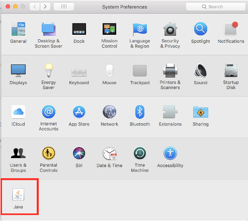
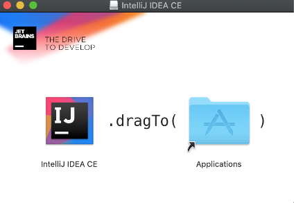
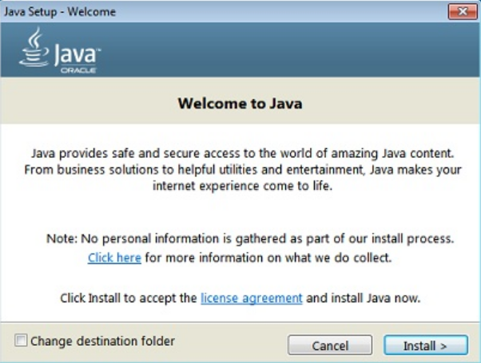
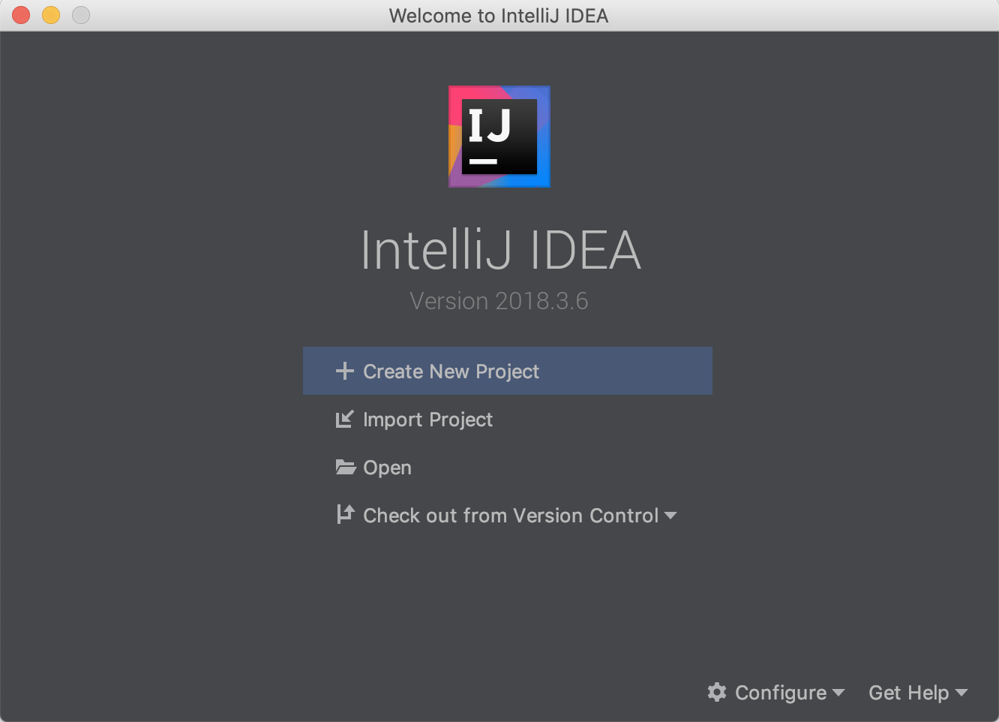
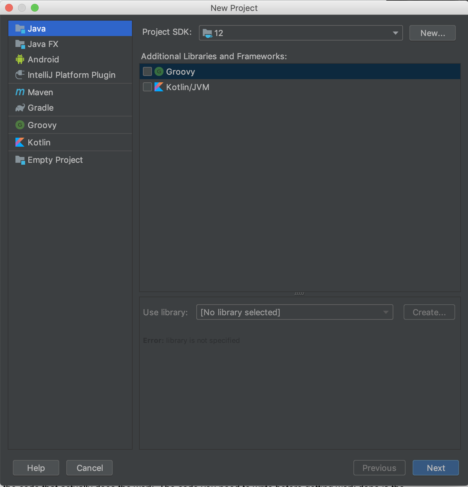
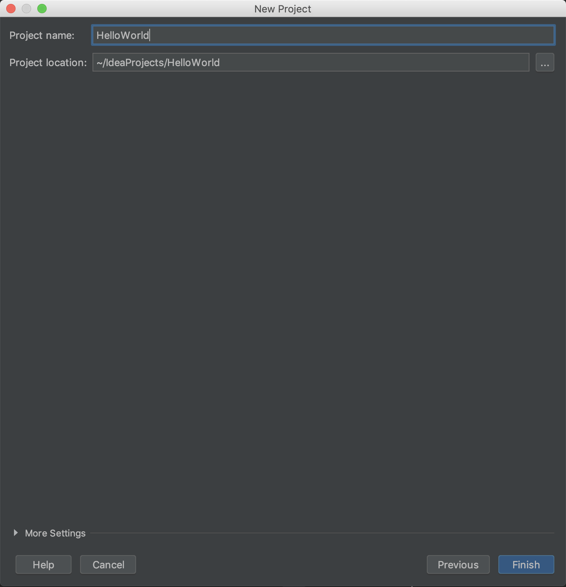
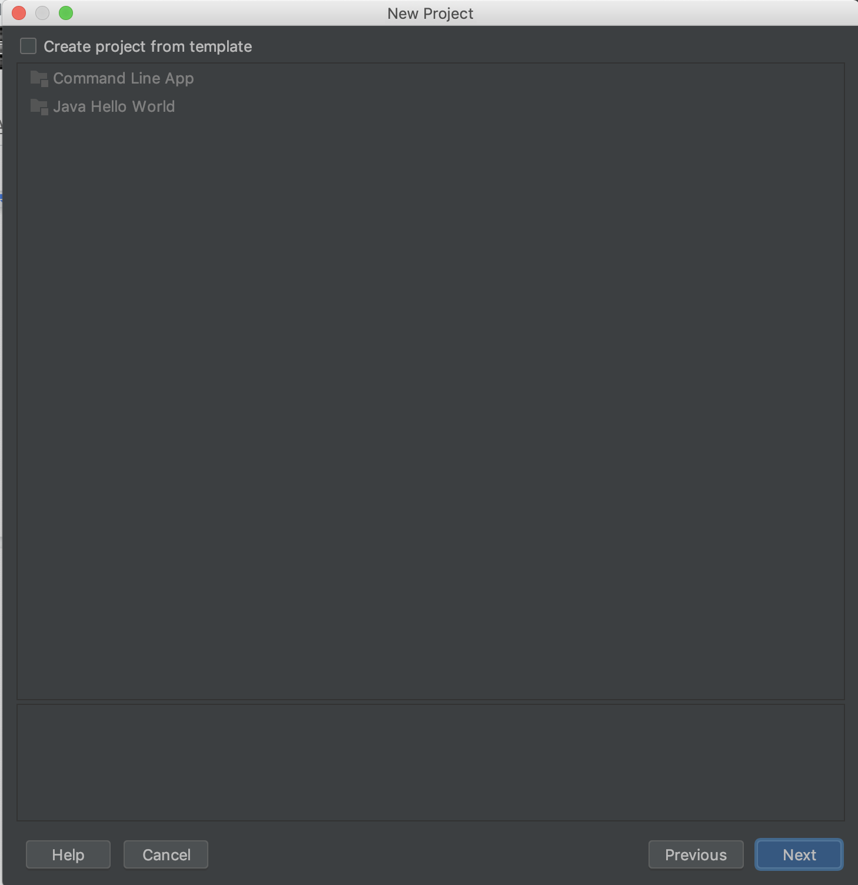
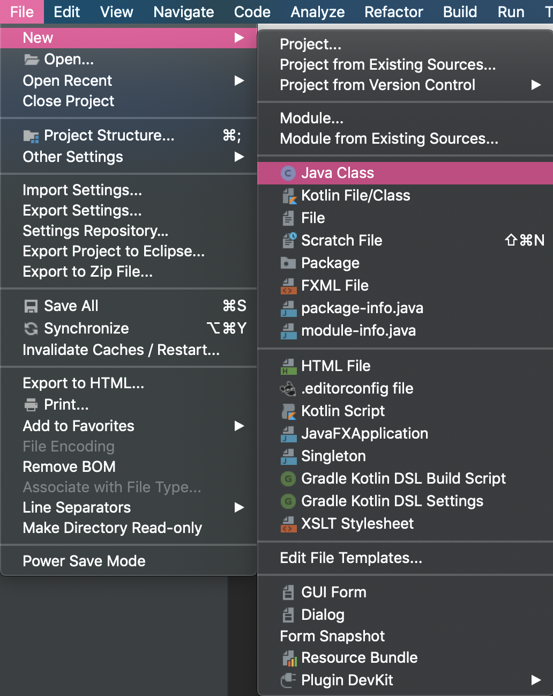
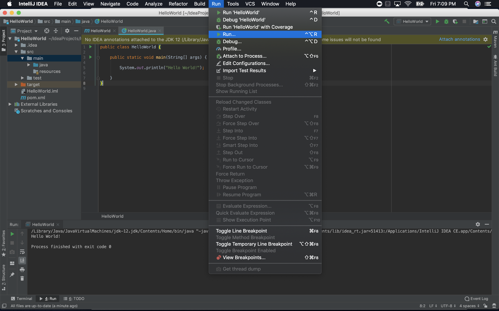

# 25.1: Java Basics

## Intro

Welcome to a short course covering basic to intermediate Java. Java is one of the most—if not the most—popular programming languages in the world. Throughout its more than 20-year lifespan, it has gone through many iterations, making it robust, powerful, and very well supported. 

Any question you might have about Java has probably already been answered in some online forum. It has the second largest StackOverflow community and the fourth largest meetup community, and is the second most tagged language on GitHub! This enormous and mature Java ecosystem brings with it a vast array of tools and libraries which make learning and using Java much easier than other languages.

## Why Learn Java? 

First and foremost, it is consistently one of the most in-demand development skills by employers. Millions of programmers and billions of devices use it worldwide. It can run on any hardware or OS, and is very popular at the enterprise level. Google has adopted it for all Android apps and 90% of Fortune 500 companies use it for back-end development. 

Java offers several advantages as a programming language—most notably in its speed and power. Until now, you’ve been working with a dynamically typed language (JavaScript). Java is statically typed, which makes it faster because the computer’s resources aren’t wasted on checking the definition of values in your code. 

Another advantage of Java is that it is a high-level language, meaning it operates independently of the OS and hardware. The Java Virtual Machine (JVM) acts as an intermediary between the program and the machine, handling things like memory allocation, which frees you up to focus on writing elegant code, compiling, and executing.  

Finally, Java is multithreaded, which makes it possible to perform multiple actions at the same time. You might recall that Node.js is single-threaded, meaning it can only perform one action at a time. 

What if you’re really into JavaScript and aren’t that interested in becoming a Java developer? Learning Java can make you a better JavaScript developer because it will get you thinking about types, improving your fluency in the functions, arguments, and arrays that you use in JavaScript. 

## What Will I Learn? 

This course is self-paced—how fast or slow you go is up to you. You’ll work independently and will need to hold yourself accountable for mastering the following concepts:

* Using Java data types and assigning variables

* The differences between dynamic and static typing

* Basic syntax for creating methods that use loops or conditionals to log data based on a criteria

* The different parts of a method signature 

* Using classes to create blueprints for objects

* Using constructors and the **new** keyword to create objects based on class blueprints

* Using file input/output in Java

* Using the built in Java 2D Graphic Library

Meticulously doing the activities is crucial. Just like in the boot camp you recently completed, if you’re diligent in completing those, you will excel. 

> **Note**: Make sure you type out each line of code in the activities. No copy-and-pasting! This is the only surefire way to learn to code. 

One thing to look forward to is that a lot of the basics we will cover are similar to things you already know in JavaScript, so some of the topics will be very familiar to you!

# Install Your Tools

Before you begin your Java journey, you need the proper tools: the Java Development Kit (JDK) and a code editor. 

VS Code and Sublime are fine editors for simpler languages like JavaScript, but a mammoth like Java needs a bonafide integrated development environment (IDE). An IDE is a robust code editor with a compiler and debugger built-in. We’ll use IntelliJ IDEA, one of the most popular IDEs in the biz.

If you’re a Mac user, follow the instructions in the next section, Mac Install Guide, to install these. If you’re using Windows, scroll down to the Windows Install Guide section. 

## Mac Install Guide

Let’s install JDK and IntelliJ IDEA on your Mac. 

> **Important**: Make sure to follow the instructions closely! Each step must be completed exactly as described in order for the installs to work.

### Install the Java Development Kit

The first tool you’ll install is Java itself. To do that, you need the Java Development Kit (JDK).

> **Note**: Before you install the JDK, you’ll need an Oracle account (they’re free). Follow [the steps here](https://docs.oracle.com/en/cloud/get-started/subscriptions-cloud/csgsg/get-oracle-com-account.html) to create one. 

1. Head over to the [JDK download page](https://www.oracle.com/technetwork/java/javase/downloads/jdk8-downloads-2133151.html).

2. Accept the license agreement under Java SE Development Kit.

3. Click the "Mac OS X x64" download option.

4. Open the installation files package once the download is complete.

5. When the installation package window pops up, double click the package icon to launch the install wizard.

6. In the Introduction section of the install wizard, click Continue.

7. The Destination Select section should automatically choose an installation location and redirect you to the next section.

8. In the Installation Type section, click Install.

9. Enter your password in the pop-up prompt, and click Install Software.

10. Once the Installation section completes, you should see a message that says "The software was successfully installed."

11. You will be automatically directed to the Summary Section, which means you've successfully installed Java!

12. Click the close button, and select "Move to Trash" for the installation files.

13. Open Terminal and run the command `java -version` to check that the install completed successfully. You can also verify that the install worked by opening System Preferences and looking for a Java icon there (see image below).



Having trouble? Watch the video on installing JDK on Mac [here](https://youtu.be/9Bw8vpjYRiA).

### IntelliJ IDEA

Next, you’ll install IntelliJ IDEA to use as your code editor. 

1. Head over to the [Download Page](https://www.jetbrains.com/idea/download/#section=mac).

2. Download the Community Edition for MacOS.

3. Run the disk image file after it downloads.

4. In the Finder window that pops up, drag the IntelliJ IDEA CE icon into your Applications folder.



5. In the Applications folder, open IntelliJ in Launchpad.

6. Click Open when prompted to open a third-party app downloaded from the internet.

7. When prompted to import IntelliJ settings from a config or installation folder, choose the default "Do not import settings" and click OK.

8. You can choose to send usage statistics or choose the "Don't send" option to keep from sharing data (totally up to you!). 

9. Next you’ll be prompted to Customize IntelliJ IDEA. You can click "Skip remaining and set defaults" or click through to set the theme, etc. until you reach the "Start Using IntelliJ" button.

10. Don't forget to eject the install drive and delete the IntelliJ IDEA disk image from your Downloads folder after successful installation.

11. Congratulations! You've installed IntelliJ IDEA!

> **Hint**: Having trouble? Watch the video on installing IntelliJ IDEA on Mac [here](https://youtu.be/TYQan9aRAbs).

Give yourself a pat on the back! Installations can be tedious, but they provide the pillars for everything you will do going forward.

## Windows Install Guide

Let’s install JDK and IntelliJ IDEA on your Windows computer. 

> **Important**: Make sure to follow the instructions closely! Each step must be completed exactly as described in order for the installs to work.

### The Java Development Kit

The first tool you’ll install is Java itself. To do that, you need the Java Development Kit (JDK).

> **Note**: Before you install the JDK, you’ll need an Oracle account (they’re free). Follow [the steps here](https://docs.oracle.com/en/cloud/get-started/subscriptions-cloud/csgsg/get-oracle-com-account.html) to create one. 

1. Head over to the [JDK Download Page](https://www.oracle.com/technetwork/java/javase/downloads/jdk8-downloads-2133151.html).

2. Accept the license agreement under Java SE Development Kit.

3. Click the Windows x86 download option.

4. Run the install file.

5. On the first setup page, click Next.



6. Select the install path and click next.

7. On the "Change in License Terms" page, click OK.

8. Once again, choose the installation directory.

9. Click Next.

10. When the Complete page appears, you've successfully installed Java!

> **Hint**: Having trouble? Watch the video on installing JDK on Windows [here](https://youtu.be/o25N3nb_yiM).

### Install IntelliJ IDEA

Next you’ll install IntelliJ IDEA to use as your code editor. 

1. Head over to the IntelliJ IDEA [download page](https://www.jetbrains.com/idea/download/#section=windows).

2. Download the Community Edition.

3. Run the install file.

4. On the first setup page, choose next.

5. Select the destination folder and click next.

6. Mark the "Update PATH variable option", create the .java association, and click Next.

7. Click Install.

8. Choose your option for when to reboot.

9. Once you've rebooted, launch IntelliJ.

10. Accept the Privacy Policy and continue.

11. You can choose to send usage statistics, or choose the "Don't send" option to keep from sharing data.

12. Congrats! You've installed IntelliJ IDEA!

Having trouble? Watch the video on installing IntelliJ IDEA on Windows [here](https://youtu.be/JOc9lVFVQso).

Give yourself a pat on the back! Installations can be tedious, but they provide the pillars for everything you will do going forward.

# Lesson 1: Hello, World

One of the first things many developers do when learning a new language is to write a "Hello, World!" program. Why be any different? Let’s do this in Java. 

Creating a "Hello, World" program in JavaScript was pretty simple. In Java, it's a tiny bit more verbose. This is because Java is a **high-ceremony language**, unlike languages like Python or Ruby. This means that it you need to write a fair amount of code before you write the code that actually does the work you want it to do. 

Let’s start with that code. But first, we should familiarize ourselves with IntelliJ IDEA. 

Open IntelliJ IDEA, and you will be greeted with a screen where you can create a new project:



Click Create New Project.

You’ll see a screen asking what type of project you want to create. Java should be selected by default. Without checking any additional boxes or changing anything, click Next.



Now you need to name your project. Let’s name it HelloWorld.



This will bring you to a page where you can choose a template. Since you want to learn all you can, let’s move ahead without choosing a template for now and click Next.



That should do it! You are now on the main editor window of your project. Let’s go ahead and create our first class. 

To do this, click your **src** folder in the directory navigator on the left side of the window. Then go to File > New... > Java Class and give it the name HelloWorld.



Great! You’ve created your very first class! IntelliJ should now open to your newly created HelloWorld.java file and you will see the following:

> **Note**: When creating a class, the name of the file must correspond to the name of the class in your code. You named your file HelloWorld, so you’ll see that your class is also named HelloWorld.

```java
public class HelloWorld {
}
```


> **Note**: You’ll see **public** a lot in Java. **public** (as opposed to **private**) is a keyword used in a method or variable declaration that signifies that the method or variable can be accessed by elements in other classes. For more information about **public** or anything else Java-related, check out [Oracle Docs]([https://docs.oracle.com/en/java/index.html](https://docs.oracle.com/en/java/index.html)), a fantastic resource for everything Java.

So far you’ve worked with classes in JavaScript and may remember that a class is essentially a blueprint that can be used to create new objects using the **new** keyword. While we can instantiate new objects from classes in Java, we’ll often use classes for their static properties and methods without creating new objects. This means that classes *themselves* can be used similarly to how we use objects in JavaScript.

Unlike JavaScript, in Java, all of our code must be written inside of a class. There’s no concept of global variables or functions. At least one class in every Java program needs a **main** method.  It serves as an entry point for the program and is what gets everything started. Add the main method right inside of your HelloWorld class declaration.

```java
public class HelloWorld {
  public static void main(String[] args) {

  }
}
```


Every Java program requires an entry point, and that entry point is the **main method.** It is required in all programs (we will dissect the keywords in this method later in the lesson).

```java
public static void main(String[] args){}
```

Though we aren’t calling this method ourselves, it does accept a String array of arguments when the program first starts. 

> **Note**: Does this remind you of anything in Node.js? It should! It’s similar to **process.argv**, which can be used to pass in arguments to a Node.js application.

The above code is what makes Java a **high-ceremony language**. Unlike in JavaScript where we can just write **console.log("Hello, World!")**, Java takes a bit more code to get to that point. 

Now that we’ve gone through the ceremony, let’s get "Hello, World!" printing out! Inside the main method, let’s add the code that will print out “Hello, World!”:

```java
public class HelloWorld {
    public static void main(String[] args) {
        System.out.println("Hello, World!");
    }
}
```

Similar to how **log** is a method of the **window.console** object in JavaScript, **println** is a method of the **System.out** object and is used to print messages to the console.

Great! We have the code necessary to print "Hello, World!". But how do we run this? 

In JavaScript, we can run our code as is, like so:

```java
console.log("Hello, World!");
```

But in Java, we need to first go through a step called **compilation**. When we compile, our Java code is converted into **byte code**. This byte code is readable by the JVM and allows the code we write to be run and understood by any computer with the JVM installed. Voila!

Inside IntelliJ IDE, right-click HelloWorld.java, then click Run ‘HelloWorld.main()’. 

Your code will be compiled and then run, which should open a window in the bottom of your editor showing the path to the java.exe file, the file you are running, and then the line you printed: "Hello, World!". 

Congratulations, you’ve written your first Java program!



# Lesson 2: Statically-Typed Variables

In this lesson, we will go over the statically-typed structure of Java. 

The JavaScript you’re used to is dynamically-typed, which allowed for more flexibility in variable declaration and return typing. But this makes JavaScript less efficient than Java because the computer must do a lot of value-definition checking when the program runs. 

Let’s jump into learning how to harness this powerful characteristic of Java. 

## Variables Overview

You might recall that JavaScript is a dynamically typed language. This means you can have a variable that holds one type of data (like a boolean) which can later hold another type of data (like a string).

```js
var isFavorite = false;
isFavorite = "not really";=
```

Java is a **statically typed** language. It requires you to declare a variable along with the **type** of data it will hold. This means that when you declare a variable, you must tell the computer what type of data it will hold and the type of data it holds can never change.

```java
boolean isFavorite = false;
String favString = "not really";
```

Java exposes many built-in types, but we will only need a subset of these to progress through this unit. Using the same process that we did for our HelloWorld project, create a new project called VariableTypes, and create an associated class with the same name. Add your main method to the class.

```java
public class VariableTypes {
 public static void main(String[] args) {

  }
}
```

Inside the main method, we can start exploring the different data types:

A **String** indicates strings:

```java
String name = "Cleopatra";
```

An **Int** indicates whole numbers (e.g., 1, 2, 3):

```java
int age = 2016 + 69;
```

A **Double** stores decimal values (e.g., 1.2, 2.3, 3.54):

```java
double price = 1999.99;
```

A **Boolean** stores boolean values (e.g., true or false):

```java
boolean truth = true;
boolean falseness = !truth;
```

## Variables Practice

Now that we have a handle on Java’s data types, let's practice thinking about how to use them. 

Using the same process that you did for our HelloWorld and VariableTypes projects, create a new project called VariablesPractice and create a new class with a main method.

Inside the main method, do the following and try to answer the questions. Try different types until you can figure it out.

* Create two variables: one int and one Double. Add them together to find the sum, and store the result as a variable called **sum**. What type is **sum**?

* Create a String variable. Add it to your int and store the result as a variable. What type is it?

* When you think you know the data types of the resultant variables, use **System.out.println** to check the values.

* Is **sum** a whole number or a decimal value?

Decimal value, as **b** is a decimal value.

* What happens when we add a string and a number together in JavaScript?

The string and number will be concatenated. I.e. `4 + cat = 4cat.`

```java
public class VariablesPractice {

  public static void main(String[] args) {

    int a = 4;
    double b = 3.5;
    String c = "cat";

    // calculated variable sum is a double
    double sum = a + b;

    // calculated variable concat is a String
    String concat = a + c;

    // value of sum is 7.5
    System.out.println(sum);

    // value of concat is "4cat"
    System.out.println(concat);

  }
}
```

# Lesson 3: Arrays in Java

Arrays in Java are similar to the arrays you’ve worked with in JavaScript. The most important difference is that in Java, once initialized, an Array can only hold a fixed amount of elements. If you initialize an array with a size of 4, it will only ever be able to hold 4 elements. In JavaScript, arrays could hold as many or few elements as you wanted, without having to choose the size at creation.

We’ve worked with creating variables of a certain type that can hold a single value. That’s fine for small programs, but as things become more complex, you may want or need to hold more data inside a single variable. For that, you use an array.

An **array** is a data structure that allows for a **fixed number** of values of the **same type**, and that is important to remember. You must first specify the length of the array, which cannot be changed in the future. You must also declare its type, and this also cannot be changed. 

Let’s look at how you declare an array with a type using the declaration we are used to:

```java
int[] arr1;
```

The above syntax is called an **array declaration.** 

We have declared an array, but nothing is being done with it yet. Let’s look at what is called an **array initialization**.In order for us to do something with an array, we must first initialize it. Initialization of an array includes defining a name and the number of elements it will hold.

```java
public static void main(String[] args) {
  int[] arr1 = new int[4];
  arr1[0] = 10;
  arr1[1] = 20;
  arr1[2] = 30;
  arr1[3] = 40;

  int[] arr2 = {10, 20, 30, 40};
}
```

Just like JavaScript, Java uses **zero indexing**. This means that array indexing starts at 0. If we wanted to print out one of our elements, we would just pass it to **System.out.println()** like this:

```java
public static void main(String[] args) {
  int[] arr1 = new int[2];
  arr1[0] = 10;
  arr1[1] = 20;
  System.out.println(arr1[0])
}
```

Why don’t we tie this together with something we learned in previous lessons? We can add elements to an array and then print the array to the console with a method from the Arrays class, `.toString();`. Let’s go ahead and do that.

Create a new project called **Arrays**. Inside the **Arrays** class, define the **main method**: 

```java
public class Arrays {
   public static void main(String[] args) {

   }
}
```

To work with arrays, we will need to import the **Array** package from **java.util.Arrays**:

```java
import java.util.Arrays;
```


Now that we’ve laid the foundation, let’s initialize a new array:

```java
String[] names = new String[6];
```


Next, we need to add some elements to fill this newly initialized array:

```java
names[0] = "Tammer";
names[1] = "Matt";
names[2] = "Christian";
names[3] = "Alec";
names[4] = "Xander";
names[5] = "Jared";
```


Now we want to print our array to the console. How would we go about doing that? We’ll use the **Arrays** class, and specifically a method from that class, **.toString(array)**. 

The **Arrays** class is built into Java, so all we need to do to use is import it from the java.utils package. Without using this class and method, we would not be able to properly print our array to the console.

```java
System.out.println(Arrays.toString(names));
```

Great! Run the code and you should see all the names we added to the array printed in order to your console. The completed code should look like the following.

```java
import java.util.Arrays;

public class Arrays {
  public static void main(String[] args) {
    String[] names = new String[6];
    names[0] = "Tammer";
    names[1] = "Matt";
    names[2] = "Christian";
    names[3] = "Alec";
    names[4] = "Xander";
    names[5] = "Jared";

    System.out.println(Arrays.toString(names));
  }
}
```

# Lesson 4: Basic Syntax

This lesson introduces some basic Java syntax, including keywords, modifiers, conditionals, and iteration. 

## Keywords and Modifiers

At this point, you’ve probably noticed some keywords that you aren’t familiar with. These most likely included **public**, **static**, **void**, and **main**. These are **modifiers**. By placing them in class or method declarations, they modify the behavior of the class or method. 

Let’s look at what each of these means:

* **public**—This means that this method will be available to **all** other classes that want to access it (i.e., it’s public).

* **static**—This means that we do not need to create a new object or instantiate this class to call the methods associated with it.

* **void**—This means that our method has no return value. If you do not specify the **void** modifier with a method, Java will expect a return value. If you do not provide one AND do not provide the **void** modifier, you will receive an error at compilation.

* **main**—Every Java program requires a main method. The main method is the entry point to our application and will always be written as:

```java
 public static void main(String[] args){
  //code
}
```


## Conditionals Overview

The conditional statements we will use within Java are almost identical to those you have previously used in JavaScript. Both use what we call **C-style syntax**, because both of these languages were derived from the programming language C.

Before we dig into conditionals, let’s first create a new project. Let’s name the project Conditionals, and create the class and main method for it.

```java
public class Conditionals {
  public static void main(String[] args){

  }
}
```

Now, just like you would in JavaScript, add an **if/else** statement comparing the number 5 to 1. Create two different outputs for whether the statement evaluates to true or false:

```java
public class Conditionals {
  public static void main(String[] args){
    if (5 < 1) {
      System.out.println("I hope this line doesn't print..")
    } else {
      System.out.println("Now this is correct!")
    }
  }
}
```

Which of the two statements that we wrote will print to the terminal? Run the project using the Run menu again and find out if you were correct!

## Iteration Overview

Iteration allows us to loop over items in Arrays and ArrayLists and perform some function on each item as we go through. 

Let’s take a look at some code that iterates over an ArrayList of names:

```java
import java.util.ArrayList;
import java.util.List;


public class ListsPractice {
 public static void main(String[] args) {

  ArrayList<String> names = new ArrayList<>();

  names.add("Brett");
  names.add("Tri");
  names.add("Jamila");

  System.out.println( names.get(1) );
 }
}
```

To compare it to JavaScript, this is how we'd loop through an array called **names** in JS:

```java
for(var i = 0; i < names.length; i++) {
  console.log(names[i])
}
```

This is how we'd do a similar loop through a List called **names** in Java:

```java
for (int i = 0; i < names.size(); i++) {
  System.out.println(names.get(i));
}
```

What similarities and differences do you notice in **for-loops** in Java and JavaScript? Let's take a look.

Remember that your iterator, **i**, still has to be given a type. In this case, the type is int, which is short for integer:

```java
int i = 0;
```

Instead of **.length**, we use **.size()** to get the total number of elements:

```java
i < names.size();
```

**System.out.println** is used instead of **console.log**:

```java
System.out.println();
```

And finally, you'll use **.get(i)** instead of **i** with brackets to target elements of the ArrayList by its index:

```java
names.get(i);
```

The complete code looks like this:

```java
import java.util.ArrayList;
import java.util.List;

public class ListsPractice {
  public static void main(String[] args) {

    ArrayList<String> names = new ArrayList<>();

    names.add("Brett");
    names.add("Tri");
    names.add("Jamila");

    for (int i = 0; i < names.size(); i++) {
      System.out.println(names.get(i));
    }
  }
}
```

Great work! You’ve got basic Java syntax, arrays, and variables under your belt—and you wrote your first Java program! In the next lesson we will move on to method signatures and other more complex topics.

