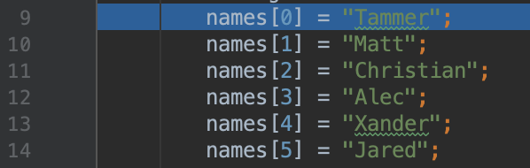
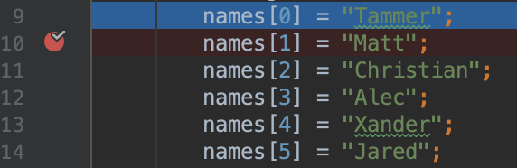

# 25.2: Java Method Signature and User Input

## Lesson 1: The Method Signature

In Java, all methods have what is called a **method signature**. The method signature is comprised of the method name and its parameter list. 

Let’s look at a few examples and identify the method signatures. First, let’s look at the following **FirstMethod** method:

```java
public void FirstMethod (int age, double height, String name) {
// method code goes here
}
```

The method signature of the above would be:

```java
FirstMethod(int, double, String)
```

This means that **FirstMethod** MUST be called with an integer, double, and a string. If it does not have these arguments, an error will be thrown.

Let’s look at another method and identify its signature.

```java
public void MapCoordinates (int x, int y, String location, String country){
// method code goes here
}
```

In the above code, what would the method signature for **MapCoordinates** be?

If you guessed what’s in the following line of code, you’re right! 

```java
MapCoordinates (int, int, String, String)
```

Method signatures give developers easy access to the method name and the list of typed parameters that are required in order to use the method properly.

The method signature is paramount for another reason. The compiler will not allow you to create two methods with the same signature that execute different code. What you can do is create another method with the same name, but a different **parameter list**. 

Look at this example:

```java
// method 1
public void FirstMethod (int age, double height, String name) {
  System.out.println("This is method 1")
}
// method 2
public void FirstMethod (int age, double height, String name) {
  System.out.println("This is method 2")
}
```

The above code will NOT work because the methods have identical signatures.

Here is an example of using the same name but a different signature, which does work.

```java
// method 1
public void FirstMethod (int age, double height, String name) {
  System.out.println("This is method 1")
}
// method 2
public void FirstMethod (int age, double height, double weight, String name) {
  System.out.println("This is method 2")
}

FirstMethod(35, 5.8, "clark"); // "This is method 1"
FirstMethod(28, 5.8, 200, "tammer"); // "This is method 2"
```

Notice that the names of the methods are the same, but when we pass the different signature parameters, we receive the proper output from the method that we wanted.

# Lesson 2: Generating Random Numbers

In this lesson, we will generate random numbers using Java’s built-in **Random** class. Random number generation can be used for many things. You can use it to simulate dice rolls and user input, or any other function that requires randomization.

> **Note**: We won’t go over every feature of the **Random** class. We’ll just scratch the surface and use it to generate some random numbers so you have an idea of what it can do.

Let’s begin by creating a new project called **RandomNumber** and then add the main method under it: 

```java
public class RandomNumber {

   public static void main(String[] args) {

   }
}
```

Now that we have our main method, we can generate a random number. To do this, we first need to import the **Random** class from the **java.util.Random** package.

## Packages

Packages in Java are groups of similar types of classes, interfaces, and sub-packages. When pulling a package into your project, you are pulling in all the associated classes and methods, allowing you to use the functionality that’s built into that package. 

> **Note**: You can think of a Java package just like the NPM packages you used with NodeJS. They provide you with functionality, and only by importing them into your project can you use that functionality.

Add the following package import above **public class Main**:

```java
import java.util.Random;
```


Adding this line allows us to access the methods associated with this class. 

Now that we’ve pulled in our **Random** class, we need to **instantiate** a new instance of this class, creating a new **Random object**. To do this, we will use the **new** keyword, like so:

```java
Random randomGenerator = new Random();
```

You will notice that we did not specify a data type like the ones we went over previously (int, String, etc.). Classes can also be data types: when we create a new object, the class it is being derived from will be its type. So in this case, **randomGenerator** is of type **Random**.

Great! We now have everything in place to generate a random number. Let’s do that now.

```java
public class RandomNumber {

  public static void main(String[] args) {
    Random randomGenerator = new Random();

    int randomInt = randomGenerator.nextInt(4);

    System.out.println(randomInt);
   }
}
```


Running this code will produce a random number between zero and three (0–3). When we specify **nextInt(4)**,we are saying we want a random number anywhere in the range of 0 to 4. So that leaves us with 0, 1, 2, and 3 as a possible result.

What if we wanted random numbers between 1 and 4? How would we do that?

It’s simple, all we need to do is add 1 to our random generation. Let’s generate a random number between 1 and 6.

```java
public class RandomNumber {

  public static void main(String[] args) {
    Random randomGenerator = new Random();

    int randomInt = randomGenerator.nextInt(6) + 1;

    System.out.println(randomInt);
   }
}
```

Here is the line that allows us to change the range of numbers we are randomly generating.

int randomInt = randomGenerator.nextInt(6) + 1;

If we were to leave off the **+ 1**, we would receive values between 0 and 5. Because we add 1 to our random number, we ensure we are receiving a number between 1 and 6. 

Go ahead and write out code that would allow for a random number between 3 and 9:

```java
public class RandomNumber {

  public static void main(String[] args) {
    Random randomGenerator = new Random();
    int randomInt = randomGenerator.nextInt(6) + 3;
    System.out.println(randomInt);
   }
}
```

# Lesson 3: ArraysList in Java

How many elements can an array in JavaScript hold? An array in Java can only hold as many elements as we specify at its declaration—the only limit is how many we can fit in memory. 

Enter the **List**. When using a standard array in Java, we need to specify its length at declaration. If we tried to enter more elements than we declared, we’d receive an error and would need to declare a new array. With a List, it will dynamically grow as the need for more elements grows. We do not need to set how many elements will exist at its declaration, allowing for much more flexibility.

Just like arrays, however, Lists are statically typed. This means that we MUST declare the type of data that we're going to store in our List.

Let's take a look at how we might use a List in a Java program.

In JavaScript, if we want to declare an empty array called **names**, we'd do the following:

```js
var names = [];
```

If we wanted to create an ArrayList in Java to serve the same purpose, we can declare that like so:

```java
List<String> names = new ArrayList<>();
```

Notice how when we instantiate a new List, we don’t call it:

```java
List<String> names = new List<>();
```

Instead, we declare a **new ArrayList<>();**. This is because List is an **interface**.

> **Note**: We will get into more detail about interfaces later. For now, just know that we cannot instantiate a new object from an interface, and instead must use something called an ArrayList.

In the above code examples, we're creating a new variable called **names**, which is a List of Strings and setting it equal to a new empty List. Let's take a second to break this down.

* **List<String>**—This is the syntax we use to specify the data type of our variable. Remember, in Java all variables must have a declared type. In this case, we're saying that this is a List that will contain Strings.

* **names**—The name of the variable to be created.

* **= new ArrayList<>();**—The value that we're assigning to our variable. In this case, we're telling Java to create a new empty List. We'll talk about what exactly **new** means in later lessons, but for now, every List we create will use this syntax.

Now that we understand how to create a List, let's create a new project in which we can play with them. Once again, using the same process we've used in our first few activities, create a new project called ListsPractice. Create a new class for this project, and add your main method.

```java
public class ListsPractice {
 public static void main(String[] args) {

 }
}
```

The first thing we need to do in order to use Lists in Java is import some related Lists libraries into our project. Arrays are built into Java, but Lists are not. They require you to import an outside library. 

> **Note**: In JavaScript, we can access additional functionality using npm packages and the **require** or **import** statement. Similarly, in Java, we use **import** statements to bring in outside libraries and provide additional functionality. 

To import Lists into our project, we add the **import** statement at the top of the code, outside the class. The libraries we want to import are **java.util.List** and **java.util.ArrayList**.

Type the following lines of code to add these libraries to your project:

```java
import java.util.List;
import java.util.ArrayList;

public class ListsPractice {

 public static void main(String[] args) {

 }
}
```

Inside the main method, create a new List called **names**, just like in our example above. Add this line of code inside of your **main method**.

```java
List<String> names = new ArrayList<>();
```


We're ready to add data to our List, but how can we do this? If we were working in JavaScript and wanted to add the name "Brett" to our array, we could do so like this:

```js
names.push("Brett");
```

Adding data to a List in Java uses similar syntax, except our method is called **add** instead of **push**:

```java
names.add("Brett");
```

Similar, right?

Add this to your main method and add a couple more names to the **names** List. When you're finished, your main method should look something like this:

```java
import java.util.List;
import java.util.ArrayList;

public class ListsPractice {

 public static void main(String[] args) {

   List<String> names = new ArrayList<>();

   names.add("Brett");
   names.add("Tri");
   names.add("Jamila");
 }
}
```

Now, let's print the second value in our List to the terminal. Just like arrays in JavaScript, Lists in Java are **zero-indexed**, meaning we start counting at 0. In JavaScript, if we wanted to access the second element of an array, we would use bracket notation to specify the element at index 1.

```java
console.log( names[1] );
```

To access elements in a Java List, we have to use a method called **get()**.

```java
System.out.println( names.get(1) );
```

Add this to your main method and then use the Run menu to run your code. The final class file should look like this:

```java
import java.util.List;
import java.util.ArrayList;

public class ListsPractice {

 public static void main(String[] args) {

   List<String> names = new ArrayList<>();

   names.add("Brett");
   names.add("Tri");
   names.add("Jamila");

   System.out.println( names.get(1) );
 }
}
```

Now we can tie everything together with a short activity.

## Your Turn

You’ve been tasked with generating random numbers and adding them into a List. Then you must log those numbers out to your console. 

Think of the following questions as you attempt to solve this problem:

1. How do you create a random number?
2. How do you create an array?
3. How do you create a new random number at each iteration?

Here’s the solution (don’t peek before you figure it out yourself!): 

```java
import java.util.ArrayList;
import java.util.List;
import java.util.Random;

public class RandomArrays {
   public static void main(String[] args) {

       List<Integer> numbers = new ArrayList<>();
       for(int i = 0; i < 10; i++){
           Random genNum = new Random();
           int randNum = genNum.nextInt(100);
           numbers.add(randNum);
           System.out.println(numbers);
       }
   }
}
```

Let’s go through this solution.

* We first create a **public class** called **RandomArrays**.

* Inside our main method, we instantiate a new List.

* We use the standard for loop notation to start our loop. 

* We first instantiate a new object from the **Random** class from the **java.util.Random** package. 

* We then create a new variable that will hold our randomly generated number. 

* This is the important part—as we iterate, we would like to add each randomly generated number to our List. We do that with this line:

```java
int randNum = genNum.nextInt(100);
numbers.add(randNum);
```

* Finally, we use **System.out.println(numbers);** to print out our array as it grows to our console. 

Great job! Run the program and you will see your random numbers print to the console!

# Lesson 4: Scanner and System.in

We have used the console up until this point to display data that we wanted to print. What if we wanted to interact with our users, and receive input from them? In your previous course, you utilized NodeJS and Inquirer to receive user input. Java has a built-in class called **Scanner**, which uses another System method, **System.in**. We can use this to receive user input, and then perform an action based on that input.

Begin by creating a project called **FirstScanner**, and then create the main method:

```java
public class FirstScanner {
   public static void main(String[] args) {

   }
}
```

To get started with Scanner, we need to instantiate a new instance of the **Scanner** class. To do this let’s import Scanner and then instantiate the object.

In order to instantiate a new Scanner object, we must tell the Scanner from where it should receive its input. Earlier we used the **System.out** to produce output to the console, so we’ll use **System.in** to receive input from the console. You might notice a keyword we haven’t used before: **new**. This lets us create a new object from a class. For now, that’s all you need to know—we will cover it in more depth a little later on.

Your code should now look like the following:

```java
import java.util.Scanner;

public class FirstScanner {
   public static void main(String[] args) {

       Scanner scanner = new Scanner(System.in);
   }
}
```

We can now prompt our user with a question, and receive some input as a response! We first need to ask our user a question. Let’s get their name by asking them for it.

Add this line of code after your **Scanner instantiation**:

```java
System.out.println("Hello! What is your name?");
```

Next, we need to capture their response. To do this, we will use a method from the **Scanner** class called **.nextLine();**. This allows us to capture String input from our users. 

Add this line to your code after the line you just added:

```java
String name = scanner.nextLine();
```

Finally, let’s print out this user input. Add this final line of code: 

```java
System.out.println("Welcome " + name);
```

Great! Now you can capture users input as a String and output that same information to them in the console. The complete code should look like the following:

```java
import java.util.Scanner;

public class FirstScanner {
   public static void main(String[] args) {

       Scanner scanner = new Scanner(System.in);
       System.out.println("Hello! What is your name?");
       String name = scanner.nextLine();
       System.out.println("Welcome " + name);
   }
}
```

What if we wanted to capture a number input by our user? Would we still use **.nextLine();**?

No, we wouldn’t! Data types are important in Java, and they continue to be important when it comes to capturing input.

Let’s add to our previous FirstScanner program and ask for our user’s age.

To do this, let’s add a new question under our name output. First, we will ask the question with **System.out**, and then add a second line of code that allows us to capture integer input:

```java
System.out.println(name + ", how old are you?");
int age = scanner.nextInt();
System.out.println("Okay! " + name + ", you are" + age + " years old");
```

Now we have a program that can ask for a user’s name and age and then print that information back out to the console. Awesome! This is what the program should look like now:

```java
import java.util.Scanner;

public class FirstScanner {
   public static void main(String[] args) {

       Scanner scanner = new Scanner(System.in);

       System.out.println("Hello! What is your name?");

       String name = scanner.nextLine();

       System.out.println("Welcome " + name);
       System.out.println(name + ", how old are you?");

       int age = scanner.nextInt();

       System.out.println("Okay! " + name + ", you are " + age + " years old");
   }
}
```

You will notice some spacing around our strings in our outputs. This makes it so that when we print to the console, it is formatted correctly and looks normal.

Go ahead and run the program. You’ll be prompted to enter a name and age, and see it print to your console! 

# Lesson 5: Switch Statements in Java

Switch statements in Java function the same way with the same syntax that you’re used to from JavaScript. We can use them to control the flow of our program, especially when paired with **Scanner** and **System.in**. Then we can let the user choose options and receive prompts based on those selections. 

Just like in JavaScript, a switch statement consists of a case (a condition), the code that condition will execute, a break (will terminate the switch statement when a case is met), and a **default** which will be fired off if none of the cases are met. 

Here’s an example:

```java
switch(expression) {
  case x:
    // code block
    break;
  case y:
    // code block
    break;
  default:
    // code block
}
```

Where are these useful? Well, when receiving user input, we may want to make a decision and run certain code based on the user’s input. The **switch** statement will allow us to do just that. Let’s incorporate a **switch** statement into our code along with a **Scanner** to capture user input.

First let’s create a new project called ScannerSwitch. Inside the src folder, create a new Java class and name it **ScannerSwitch**:

```java
public class ScannerSwitch {
   public static void main(String[] args) {

   }
}
```

In this project, we will simply ask the user for their name and then ask them to confirm whether it is correct or not. We will then execute distinct code based on the "yes" or “no” response received.

Let’s bring in the necessary packages. For this exercise, we only need to bring in **Scanner**. Add this line of code above the public class at the top of the file:

```java
import java.util.Scanner;
```


Great! That’s all the basic setup we need for this project. Just like all of our previous projects, once our main method has been declared, we can begin to code. 

First, we will need to instantiate a new instance of the **Scanner** class for use a bit later in our program. In the main method, type the following code:

```java
Scanner scanner = new Scanner(System.in);
```

> **Note**: We named the object **scanner**, but you can name it whatever you like!

Now that we have that set up, we need to prompt our user with a message. How do we write to our console?

Correct! We use **System.out.println();**. Add the following line of code after our scanner instantiation:

```java
System.out.println("Hello! What is your name?");
```

Now that we’ve asked the question, we need to capture our users response. How do we go about capturing user input?

We use **scanner.nextLine();** and save that to a String variable. Add this line of code after the one you just added:

```java
String name = scanner.nextLine();
```


Now that we’ve captured the user’s response to a variable, let’s print that back to them and ask for confirmation. Add the following line of code to the next line: 

```java
System.out.println("Your name is " + name + ". Is that correct? Enter yes or no");
```


We can now capture the user’s next response, which will be what we use in the following **switch** statement. Let’s do that in a new String variable by adding the following code: 

```java
String response = scanner.nextLine();
```


What happens if our user were to input an uppercase **Y** in their answer? Our code would not work. To fix these kind of edge cases we can use the **.toLowerCase()** method on our users input.

String response = scanner.nextLine().toLowerCase();

Excellent! We are ready to build our **switch** statement based on what is stored in the **response** variable. Looking at the example of the **switch** statement provided at the beginning of this lesson, what do you think it will look like? 

Let’s go ahead and build it together. First we need to set our **switch** and give it the **variable** we will be basing our **cases** on. The first line of our **switch** statement will look like this:

```java
switch(response){

}
```


Next, we need to provide a **case.** The case will execute some code based on whether it matches the user’s response. Let’s first start with a response of "yes." The case will look like the following:

```java
case "yes":
   System.out.println("Great! Welcome, " + name);
   break;
   ```

At this point, our `switch` statement should look like:

```java
switch(response){
  case "yes":
     System.out.println("Great! Welcome, " + name);
     break;
}
```


Finally, we need to deal with a response of "no." What should we do if the user tells us the name they entered is incorrect? We should prompt them for a new name! 

Try building out the "no case" yourself. Remember—if they choose no, we must prompt and receive a new name:

```java
case "no":
   System.out.println("Sorry! Please re-enter your name");
   String newName = scanner.nextLine().toLowerCase();
   System.out.println("Got it, your name is " + newName);
   break;
```

The final piece to our switch statement is the **default case**. This will be fired if the input given does not match any of the cases we provided.

Add the following code to prompt the user to enter a value if they enter something other than "yes" or “no”.

```java
default:
   System.out.println("Please enter yes or no");
   ```

Our complete `switch` statement should look like the following:

```java
switch(response) {
   case "yes":
       System.out.println("Great! Welcome, " + name);
       break;
   case "no":
       System.out.println("Sorry! Please re-enter your name");
       String newName = scanner.nextLine().toLowerCase();
       System.out.println("Got it, your name is " + newName);
       break;
   default:
       System.out.println("Please enter yes or no");
}
```

Now that we have finished the switch statement, our program is complete. Here is the completed code:

```java
import java.util.Scanner;

public class ScannerSwitch {
   public static void main(String[] args) {
       Scanner scanner = new Scanner(System.in);

       System.out.println("Hello! What is your name?");

       String name = scanner.nextLine().toLowerCase();

       System.out.println("Your name is " + name + ". Is that correct? Enter yes or no");

       String response = scanner.nextLine();

       switch(response) {
           case "yes":
               System.out.println("Great! Welcome, " + name);
               break;
           case "no":
               System.out.println("Sorry! Please re-enter your name");
               String newName = scanner.nextLine().toLowerCase();
               System.out.println("Got it, your name is " + newName);
               break;
           default:
               System.out.println("Please enter Yes or No");
       }
   }
}
```

Run your newly completed program and you will be prompted for a name. You will then be asked to confirm if this is correct, and based on your response, the corresponding code will run. 

Congratulations—your programs are becoming a bit more complex!

# Lesson 6: Classes and Objects

Classes in Java are considered the blueprints from which objects are created. Classes can contain any number of the following different types of variables: local, instance, and class variables.

Just like in JavaScript, where and how we define our variables is paramount to the functionality of our programs. Something you will remember is the term **scope**. Scope will impact what variables and methods can be accessed from other classes and objects, and just like in JavaScript, improper scoping can lead to errors and problems accessing data. 

> **Note**: We will get into scope more in the next lesson. 

Let’s equate this to the Scanner class we’ve used, which is built into Java. When we instantiate a new object of the Scanner class, like so:

```java
Scanner scanner = new Scanner(System.in);
```

We are able to access methods associated with the Scanner class our object was created from (like **Scanner.nextLine();**). 

> **Note**: There are numerous other methods attached to the Scanner class, but we did not need to use them. Just know they are available to you.

Like we said earlier, **classes** are our blueprint for the **objects** we will create. When we create an object, you can think of it as a copy of the class it’s being created from. 

There are three steps to object creation: 

* **Declaration**—A variable declaration with a variable name with an object type.

* **Instantiation**—The **new** keyword is used to create the object.

* **Initialization**—The **new** keyword is followed by a call to a constructor. This call initializes the new object.


The **new** keyword in Java is used to instantiate a new object from a class. When using the **new** keyword, it calls the **constructor** of the class you are instantiating the object from. 

Let’s take a look at a simple example of using **new** and a **constructor**.

```java
// Create a FirstConstruct class
class FirstConstruct {
  int x;  // Create a class attribute
  String name; // Create another class attribute

  // Create a class constructor for the FirstConstruct class
  public FirstConstruct() {
	x = 5;  // Set the initial value for the class attribute x
    name = "tam";
  }
}
// Create an object of class FirstConstruct (This will call the constructor associated with FirstConstruct)
FirstConstruct myObj = new FirstConstruct(); 
System.out.println(myObj.x); // Print the value of x
System.out.println(myObj.name); // Print the value of name

// Outputs 5
// Outputs tam</td>
  </tr>
  <tr>
    <td>
```

When the **new** keyword and a constructor are used together, the JVM creates a new object in a part of memory called the **heap** and hands us a **reference** to that object. References contain the location of the newly created object on the heap and allow us to access/use the object (more on this in a minute as well). 

When the JVM allocates memory, there are four possible places it will do so. The next lesson will talk a bit about two of these memory allocation points.

# Lesson 7: Scoping

The **scope** of a variable refers to where it is accessible from within the rest of the code. 

The following scopes are available in Java:

* **Member Variables / Class-Level Scope**—These variables are declared inside a class (not within a method) and can be accessed anywhere inside the class.

* **Local Variables / Method-Level Scope**—These variables are declared inside a method and can only be used within the method in which they were declared. A local variable is declared within a method or a constructor. The scope and lifetime are limited to the method itself; this means that when the method is completed, the variable is destroyed

* **Loop Variables / Block Scope**—Declared inside a block and not usable outside of it. Any variables declared within a loop are local to that loop. That means that when the loop is complete, the variables declared within that loop are no longer accessible. This goes the same for block scoping; variables declared within a block are only accessible within that block.

The following modifiers can be added to a variable to further refine their scope:

* **Public**—Visible/usable by any class.

* **Protected**—Can be accessed within the package it was declared in. Can also be seen or accessed by subclasses or package members.

* **Default**—Default is Package-Private. This means that all classes within the same package can access the variable, but not outside the package.

* **Private**—Only the class in which it was declared can access it.

Scoping in programming is extremely important. Where you declare a variable is one of the most important parts of declaration. You need to make sure you are properly scoping your variables so they are accessible where they are needed and exist only as long as necessary. This can be a tricky idea to wrap your head around, but with time and practice it can help you write cleaner and more efficient code.  

Let’s take a look at some code examples that show different scopes.

## Class Scope

```java
public class ClassScope {
  private int money = 0;
  public void addMoney() {
  money++;
  }
  public void subtractMoney() {
  int savings = money + 1;
  }	
}
```


In **ClassScope**, we declared an integer variable named **money.** This can be accessed by any methods that are in the class. If we were to remove the **private** modifier, it would be accessible anywhere in the package.

## Method Scope

```java
public class MethodScope {
  public method1() {
    int age = 28
  }
  public method2() {
    age = age + 1
    // this will have a compile error, age cannot be resolved to a variable
  }
}
```


In **MethodScope**, we declared two methods. In the first, we declared a variable **age**, and gave it a value of 28. In our second method, we attempted to access the **age** variable, but it is not available in **method2**. This is because method-scoped variables are only accessible within the method in which we declare them. Therefore, we can use **age** in **method1** but not in any other methods.

## Block Scope

```java
public class BlockScope {
  for(int i=0; i<10; i++){
    int j = 0
    j++;
  }
 System.out.println(j);
 // this will have a compile error; age cannot be resolved to a variable
}
```


In **BlockScope**, we wrote a for loop, and in that loop we declared an integer variable **j**. Within the for loop, the variable is accessible, but outside of the loop you cannot access **j**. That is a **block scoped variable**.

Scope can impact your programs in many ways, and declaring a variable in the wrong place will leave you with errors or an inability to access variables or data where you need it. Being careful about when and where you declare a variable can save you many headaches and memory in the future.

# Lesson 8: Return Types

In Java, we can set a return type for our methods. When we do this, we are telling the compiler the data type of what is going to come back from the method when called. 

Let’s take a look at what a return typed method can look like:

```java
public static int mult1and1() {
   int y = 1 * 1;
   return y;
}

public static int mult1and2() {
   int y = 1 * 2;
   return y;
}

public static int mult(int a, int b) {
   int y = a * b;
   return y;
}
```


* Methods can return values to the caller, but they don’t have to.

* We have seen examples of both in our code so far:

    * **System.out.println(…)** does not return a value to the caller; it simply does some work for us.  It prints a value to the console.

    * The Scanner method **nextLine()** does return a value to us. Remember that it returns the string of characters the user typed in.

* Even if our method does not have a return value, we must always indicate a return type. The return type for a method that returns no value is **void**. Otherwise, it is the type of whatever value is returned from the method.

We saw an example of when we do have a return type, but what if our method doesn’t return anything? When your method has no return value, use the modifier **void** to let the compiler know that this method has no return type. 

Here is an example of a method with no return type:

```java
public static void sayHi() {
  System.out.println("Hi!");
}
```


In the above code, the method has no return value. All this method would do is print "Hi!" to our console. Because of this, we have no need to declare a return type. 

Removing **void** would cause an error saying we are required to add a return type:

```java
public static sayHi() {
  System.out.println("Hi!");
}
// Error "invalid method declaration; return type required"
```


# Lesson 9: Comments and Debugging 

Just like in JavaScript, commenting in Java is an important part of the programming process. Though comments themselves don’t necessarily execute any functionality, they do let you and anyone else reading your code know what you were doing at that point in time. 

Having this level of detail in your code is helpful for many reasons. Imagine a scenario where you are working on a project and it’s getting quite complex. Suddenly, you are pulled into a different project and have to put the previous one on hold? A well-commented program allows you to jump right back into work later, with the comments telling you what methods did what. 

Comments offer the same benefit for other programmers who join the project to analyze your code or help you write more: they give context to what would normally just be lines and lines of code.

## Comments

There are two different types of comments:

### Block Comments

Block comments start with ```/*``` and end with ```*/```. They can span multiple lines (thus the name, "block").

### Single-Line Comments

A single-line comment should not be longer than one line. Everything after ```//``` is a comment. You can see in the example below what happens if a single-line comment spills over onto a second line. 

Let’s look at an example of both a block comment and a single-line comment.

```java
public static int mult(int a, int b) {
   int y = a * b;
   /* This is a block comment,
   as you can see this can span multiple lines without breaking
   and can allow for longer comments or deeper explanation into a function
   or plans for what to do in the future. */
   return y;
   // this is a single line comment,
  and continuing to the next line would escape the comment and cause an      error
}
```


## Debugging

Debugging is an incredibly valuable tool to have in your kit. Debugging is something that beginners often overlook, and can lead them to lots of headaches they could have solved. 

Sometimes our code is not executing exactly how we thought it would. In these cases, the debugger allows us to step in at certain points and see what is actually going on versus what we are seeing at execution. This enables us to pinpoint exactly where things are going wrong and observe the state of our program wherever we choose.

We use breakpoints in IntelliJIDEA to pinpoint where we want to observe the current state of our program. Setting those up is super simple! 

The following image shows lines of code that set different values of a name array to values we want it to hold:



In the left column, click to the right of the line numbers to set a breakpoint:



The red dot indicates a breakpoint. If you click Run > Debug, you will see an output in your console showing the variables’ values and methods state at each breakpoint you set. 

We won’t go deeper into debugging here—just remember that it is a vital tool that should be remembered and used whenever you’re in need of troubleshooting. Using the debugger while you write code is a habit you should get into—it will make you a better programmer.

Great job working through these lessons! You learned about the method signature, random number generation, array lists, scanner and receiving user input, scoping, and return types. That’s a lot of content, so pat yourself on the back for your hard work. In the next lesson, we will cover object-oriented concepts in Java, as well as writing to files, reading files, and using Java’s built in 2D graphic library. 

