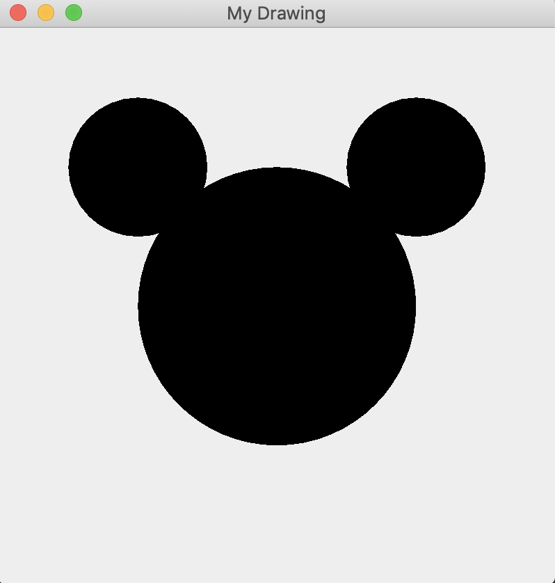

# 25.3:  Java 2D Graphics and  File IO

## Lesson 1: Object-Oriented Concepts in Java

Java is an object-oriented programming (OOP) language. OOP is a rich programming paradigm that builds on the concepts of **abstraction**, **encapsulation**, **inheritance**, and **polymorphism** (more on these below).

In OOP, data, properties, and functions are bundled together in something called an object. An object is code that allows a developer to create identical or similar objects without needing to rewrite the object’s code. This is achieved by first creating a class, which acts as a blueprint for objects of that class. You can then easily create an **instance** of the object, which is a copy of the object built from the blueprint.

> **Note**: In JS, we used constructor functions to make new objects. Java classes allow us to do something similar. 

Let’s take a look at an example that might help clarify classes and objects. Imagine that we have a class of **Car**. Cars can accelerate, honk, stop, and have a speed at any given time. We can create **objects** from this **Car** class, like a Ford Fiesta or Honda Accord. ** 

These are cars, but they are each their own version of a car. Because these **Car** objects were created from the **Car** class, they inherit all the functionality found in the main **Car** class but are also their own distinct objects created from that class.

The following code shows what this would look like:

```java
public class Car {
  int mileage;
  int currentSpeed;
  String make;
  String name;

  // Constructor for creating new Car objects
  public Car (String name) {
    this.name = name;
  }
  
  public void honk() {
    System.out.println("Honk honk");
  }

  public void stop() {
    System.out.println("Hit the breaks!");
    currentSpeed = 0;
  }

  public void accelerate() {
    currentSpeed = currentSpeed + 15;
  }
  
  public void printSpeed() {
    System.out.println("The " + name + " is going " + currentSpeed + " miles per hour");
  }
}
```

Now that we have created a basic `Car`class, we can go ahead and create some objects based on this class. These objects will inherit all the methods and attributes associated with the class they’re derived from. 

```java
public class CarObjects {
  public static void main(String[] args) {
    Car ford = new Car("Ford");
    Car honda = new Car("Honda");
    // we have created a Ford and Honda object from the Car class

    // call the accelerate method on each of our new Car Objects
    ford.accelerate();
    honda.accelerate();

    // print their current speed which should be 1 mile per hour
    ford.printSpeed();
    honda.printSpeed();
    /* call honk, then stop, then print our current speed which should now be 0 */
    honda.honk();
    honda.stop();
    honda.printSpeed();
  }
}
```

Running `CarObjects`should give you an output like the following:

`The Ford is going 15 miles per hour

The Honda is going 15 miles per hour

Honk honk

The Honda is going 0 miles per hour`

## The Four Pillars of OOP

There are four main concepts of Java OOP (object-oriented programming) that we will briefly go over. We will not be doing a very deep dive, so feel free to research more later. A link to Oracles documentation will be provided at the end of the unit.

The four pillars of Java OOP are:

* **Abstraction**—This is the process of keeping or hiding implementation details from the user. The only thing the user receives is functionality. All you would need to know is which methods are available on an object and its signature, and you can use the methods. You do not need to know about what the method does behind the scenes, what side effects it may have, or what it even needs to due to produce the result you are looking for. This hiding of implementation is abstraction

* **Encapsulation**—This is the process of bundling methods and variables into a single place that can show the developer the state of an object. This is our class. Encapsulation at its most basic is the process in which we design a class, creating a blueprint for future object instantiation.

* **Inheritance**—This allows for classes to be derived from other classes, receiving their attributes and functionality. Inheritance at its most basic is shown in our above **Car** example. When we created a new car, that new object **inherited** all of the functionality the original blueprint it was created from had.

* **Polymorphism**—This allows for the subclasses of a class to create their own unique methods and functionality, while sharing some of the functionality of the parent class as well. Back to thinking of the **Car** class, we could create a new object that, while it has the method **honk()**, the honk may say **"beep beep"** instead of **“honk honk”** and keep all the other methods and functionality the same. 

# Lesson 2: Exceptions in Java

Errors occur in all programs, and handling them is an important part of programming. Each programming language has its own way of handling errors. Java uses **exceptions**. 

We have two choices when an exception occurs. We can either catch the exception or let the compiler know that it can throw an exception and allow later code to deal with it. You will see examples of exceptions and how to handle them in a bit.

There are two main categories of exceptions in Java. 

* **Checked Exceptions**—We are required to either catch these or specify that our code might throw an exception. The compiler will enforce this requirement.

* **Unchecked Exceptions**—We do not have catch or specify that these might arise, but we can catch them if we want to. Unchecked exceptions are typically errors that we can't or don't want to recover from. Like all things in code though, that will not always be the case. An unchecked exemption is one we do not want to catch at compile time, and stop our program from starting.

Whenever you use any kind of file input/output, an error can occur.When there is a possibility of errors, we must add special exception cases into our code. We will make sure to add these in the next few lessons.

# Lesson 3: Scanner and PrintWriter

We can use Java to create and write to files on our system. This can be useful for storing data in text files and having that data be read in later if necessary. We are going to go through the very basics of creating a file and writing to it using `Scanner`and `PrintWriter`. 

To get started, create a new project called FileCreation,and write out your main method:

```java
public class FileCreation {
  public static void main(String[] args) {

  }
}
```

Now that we have our mainmethodcompleted, we can import `PrintWriter’. This is a class built into Java, which can be imported from the java.iopackage. At the top of your file, add this code:

```java
import java.io.PrintWriter;
```

Next, we need to create a new object from the `PrintWriter`class. We will use the `new` keyword and a constructor. Type the following code inside of our main method:

```java
PrintWriter writer = new PrintWriter("our-new-file.txt", "UTF-8");
```

As you can see, our constructor takes two arguments. The first argument is the name of the file with the extension. Our file will be named our-new-file, and it will be an .txt (text)file.  The second argument is the encoding type we want to use. For our purposes, we will use UTF-8.

Now, because this program will be creating a file and writing to it, there is the possibility that it will throw an exception.To handle these, we will specify this within our method signature. 

Let’s first import the two exceptions we need to be ready for. They are also built into Java and are part of the java.io package. Add these under your `PrintWriter` import at the top of your file:

```java
import java.io.FileNotFoundException;
import java.io.UnsupportedEncodingException;
```


As we described earlier, these exceptions need to be added to the method signature. To do this, we need to add a few things to the mainmethod. 

Add the following code to your main method:

```java
public static void main(String[] args) throws FileNotFoundException, UnsupportedEncodingException {
  ```

If we do not add these exceptions, our code will not execute. This is because anytime you use I/O (input/output) functionality, exceptions can be thrown and the compiler will require you to include the proper code to catch them. 

Now that we’ve imported everything we need and added the proper exceptions to our method signature, we can create and write to a file!

Using PrintWriter is very simple. We instantiatethe object as `writer`,so we will use that name to access the methods we need. We will only need the `.println()` and `.close()`methods. We will use `writer.println()` to write lines of text to a file, and `.close()` to end the process.

Let’s get to it. Add the following lines of code under your PrintWriter object instantiation.

```java
writer.println("This will be on line 1 of our text file");
writer.println("This will be on line 2 of our text file");
writer.close();
```

The completed code should look like the following: 

```java
import java.io.FileNotFoundException;
import java.io.PrintWriter;
import java.io.UnsupportedEncodingException;

public class FileCreation {
   public static void main(String[] args) throws FileNotFoundException, UnsupportedEncodingException {

   PrintWriter writer = new PrintWriter("our-new-file.txt", "UTF-8");

   writer.println("This will be on line 1 of our text file");
   writer.println("This will be on line 2 of our text file");
   writer.close();
   }
}
```

The code above will create a text file called our-new-file.txt within our project directory. It will write two separate lines with the text we specified in our `println();`method. Using the `.close();` method will end the process, and deallocate the memory that `PrintWriter` was using. 

> **Note**: `PrintWriter` can create other types of files than text. We just used .txt for demonstration purposes.

Great job! You just created your first file and wrote to it, all in four lines of code!

# Lesson 4: BufferedReader and FileReader

There are several different ways to read a file in Java. The easiest and most useful way will be to use a class built into Java called **BufferedReader**, which is part of the **Reader** package. **BufferedReader** reads text from an input stream—in this case, our text file. 

We can start by completing the basic setup like we have had to do for all of our programs. Create a new project called **ReadAFile**. Then, write a main method.

This is our class declaration and **main method:**

```java
public class ReadAFile {
  public static void main(String[] args){

  }
}
```

In this project, we will also need a .txt file, so go ahead and create a file called data.txt in the src folder of your project and write a few lines in it, using whatever words you’d like. (Make sure it spans multiple lines). 

Here’s an example:

```java
This
Is
Multiple
Lines
```

Great! We are going to use a few built-in Java classes, so let’s go ahead and import all the proper packages. 

Above `public class ReadAFile`, add the following imports:

```java
import java.io.BufferedReader;
import java.io.FileReader;
import java.nio.file.Path;
import java.nio.file.Paths;
import java.io.IOException;
```

We will use **BufferedReader** and **FileReader** to read in our file. **Path** and **Paths** will be used so we can obtain the path to the file we want to read regardless of the OS we are using. Finally, we import **IOException**, as any I/O process requires this.

Now that we have everything we need to begin reading a file, let’s write some code! We will start with obtaining the current path the program is running from. To achieve this, we will use the **Path** and **Paths** classes.

Add the following code inside of your ReadAFiles **main method**:

```java
Path currentPath = Paths.get(System.getProperty("user.dir"));
Path filePath = Paths.get(currentPath.toString(), "src", "data.txt");
String inputFile = filePath.toString();
System.out.println(inputFile);
```

The first line of code will obtain the current path where this code is being run from and save it to the **Path** variable **currentPath**. Next, we take the user’s current path and specify that we are looking for a directory called src and a file called data.txt. We save that to a variable called **filePath**. Finally, we take our **filePath** variable and convert it to a string, then output it to the console with **System.out.println();**.

We have our user’s path and a path to the file we would like to read. So now we need to instantiate a new **BufferedReader**object as well as a **FileReader**. We will pass our newly instantiated **FileReader**into our **BufferedReader**. To do this, add this line of code under the previous code you just added:

```java
BufferedReader reader = new BufferedReader(new FileReader(inputFile));
```

We declare a new object of **BufferedReader** called **reader**. We then instantiatea new **BufferedReader** and initialize its constructor, passing in a new **FileReader** and passing the file we want to read into the **FileReader** constructor. 

Because we’ve added **FileReader** into the code, we need to catch the possible exception it can throw. To do that, add the following line to the main method after your **(String[] args)**:

```java
throws IOException
```

Our main method now looks like this:

```java
public static void main(String[] args) throws IOException {
```

Now we can actually read a line from our file. To do that, we want to use our new **reader** object and a method called **.readLine();**. Add the following line of code under the main method:

```java
String line = reader.readLine();
```

We save the value of **reader.readLine();** to a variable. The reason we do this is so that we can use the value in a while loop. The while loop will run as long as there are lines to read. 

Type the following line of code under our **reader.readLine**. This will create our while loop.

```java
while(line != null){
   System.out.println(line);
   line = reader.readLine();
}
```

Let’s go ahead and break down this while loop**.** It says "while there is a line to read (while the line is NOT null), let’s print out the line to the console and then read the next line." If there is no next line to read, we are done. 

Great! Now run this code and you should see all of the lines you wrote into data.txt logging out to the console! The complete code should look like the following:

```java
import java.io.BufferedReader;
import java.io.FileReader;
import java.nio.file.Path;
import java.nio.file.Paths;
import java.io.IOException;

public class ReadAFile {

   public static void main(String[] args) throws IOException {


       Path currentPath = Paths.get(System.getProperty("user.dir"));
       Path filePath = Paths.get(currentPath.toString(), "src", "data.txt");
       String inputFile = filePath.toString();
       System.out.println(inputFile);

       BufferedReader reader = new BufferedReader(new FileReader(inputFile));
       String line = reader.readLine();

       while(line != null){
           System.out.println(line);
           line = reader.readLine();
       }
   }
}
```

# Lesson 5: 2D Graphics Library

Java has something called the Abstract Window Toolkit (AWT) built in. This toolkit lets you draw basic two-dimensional images using code. It can be a bit complicated, so we are only going to cover the basics. 

In this lesson, you’ll use AWT to create a basic picture of a mouse’s head by creating three black circles and positioning them like this:


There are a few ways to create images using Java. We’ll use the **Canvas** and **Graphics** classes. 

We will use coordinates to draw our images, but Java does not use a standard coordinate system. You’re probably used to Cartesian (x, y) where both points can be positive or negative. In Java, the coordinate system starts in an upper-left corner leaving ONLY positive values for coordinates. Coordinates are measured in pixels.

The following image shows how Java coordinates differ from Cartesian:


Let’s get started! First, create a new project called Drawing. Then create your main method. 

```java
public class Drawing {
  public static void main(String[] args){

  }
}
```

For the purposes of this project, we will need to import a few things—mainly all of the **java.awt** package along with a package called **JFrame**. Our main class is going to extend **Canvas**, so we will receive all the methods from **Canvas**.

The **extends** keyword allows us to inherit all the functionality of the class we are extending. When we **extend** a class, we are making a **subclass**. 

> **Note**: This works the same as ReactJS components, when your component would extendthe Component class of React.

```java
import java.awt.*;
import javax.swing.JFrame;

public class Drawing extends Canvas {
  public static void main(String[] args){

  }
}
```

Now that we’ve set up our basic class, we need to set up the **frame** that we will draw in. To do this, add the following code inside of your main method:

```java
JFrame frame = new JFrame("My New Drawing");
```

This creates a new JFrame object, which is the window that will hold the canvas. Now add code that creates the canvas under the previous line:

```java
Canvas canvas = new Drawing();
```

Beneath that, add the following line of code, which sets the canvas size to have a width and height of 500 pixels:

```java
canvas.setSize(500,500);
```

Now that we have the canvas created and sized, we need to add it to our frame. We then pack it (size it to fit the canvas) and then make it visible. Add the following code to make that happen under your **canvas.setSize**:

```java
frame.add(canvas);
frame.pack();
frame.setVisible(true);
```

At this point, your code should look like the following: 

```java
import java.awt.*;
import javax.swing.JFrame;

public class Drawing extends Canvas {

   public static void main(String[] args) {
       JFrame frame = new JFrame("My Drawing");
       Canvas canvas = new Drawing();

       canvas.setSize(400, 400);

       frame.add(canvas);
       frame.pack();
       frame.setVisible(true);
   }
}
```

Runyour code and take a look at how it is progressing. So far, the only output you should see is the opening of a window. It might not seem like much, but you are well on your way!


Next, we need to write a method that will paint, or draw, our canvas as we specified. Let’s create a new method called **paint**. Add the following line of code under the closing brace of our drawing class. This will create a new method, **paint**:

```java
public void paint(Graphics g) {
   Rectangle bb = new Rectangle(100, 100, 200, 200);
}
```


In this method, we pass a **Graphics** object as an argument. We then create a **Rectangle** object and give it the dimensions of 100 x 100 x 200 x 200. We want to take this rectangle and turn it into a circle. 

Next, we will create another method called boxOval. Type this code in under your completed **paint** method.

```java
public void boxOval(Graphics g, Rectangle bb) {
   g.fillOval(bb.x, bb.y, bb.width, bb.height);
}
```

Finally let’s make this print out our circle as a drawing. To do this, we will call **boxOval** inside of **paint**:

```java
public void paint(Graphics g) {
   Rectangle bb = new Rectangle(100, 100, 200, 200);
   boxOval(g, bb);
}
```

So far, your code should look like the following:

```java
import java.awt.*;
import javax.swing.JFrame;

public class Drawing extends Canvas {

   public static void main(String[] args) {
       JFrame frame = new JFrame("My Drawing");
       Canvas canvas = new Drawing();

       canvas.setSize(400, 400);

       frame.add(canvas);
       frame.pack();
       frame.setVisible(true);
   }
  public void paint(Graphics g) {
    Rectangle bb = new Rectangle(100, 100, 200, 200);
    boxOval(g, bb);
  }
  public void boxOval(Graphics g, Rectangle bb) {
    g.fillOval(bb.x, bb.y, bb.width, bb.height);
  }
}
```

If you run this code now, you should see a black circle pop up in a new window. Now we have everything we need to move to the next phase. 

We currently have a circle. To turn that circle into a mouse, what do we need to add? Two more smaller circles! 

They don’t just need to be smaller—they also need to be positioned in such a way that makes them look like ears. To get started, create a new method and call it **mouse**:

```java
public void mouse(Graphics g, Rectangle bb){
}
```

The next thing we want to do is create a circle, so let’s call our **boxOval** method. Add this code beneath the **mouse** method:

```java
public void mouse(Graphics g, Rectangle bb){
  boxOval(g, bb);
}
```

We now want to halve the size of the circle, so we will divide the current width and height by 2. Add the following **int** code to do that:

```java
public void mouse(Graphics g, Rectangle bb){
  boxOval(g, bb);

  int dx = bb.width / 2;
  int dy = bb.height / 2;
}
```

Now that we have our newly sized circle, let’s instantiate a new **Rectangle**object with the halved sizes. Type the following line of code after the **mouse** method code block:

```java
Rectangle half = new Rectangle(bb.x, bb.y, dx, dy);
```

Finally, we need to create two new circles with the new sizes and then put them in the correct position to be ears. Add the following code to do that:

```java
half.translate(-dx / 2, -dy / 2);
boxOval(g, half);
half.translate(dx * 2, 0);
boxOval(g, half);
```

Excellent! Run this code and you should see your mouse head output to the screen in a new window. 

Your code should look like the following:

```java
import java.awt.*;
import javax.swing.JFrame;

public class Drawing extends Canvas {

   public static void main(String[] args) {
       JFrame frame = new JFrame("My Drawing");
       Canvas canvas = new Drawing();

       canvas.setSize(400, 400);

       frame.add(canvas);
       frame.pack();
       frame.setVisible(true);
   }
  public void paint(Graphics g) {
    Rectangle bb = new Rectangle(100, 100, 200, 200);
    boxOval(g, bb);
  }
  public void boxOval(Graphics g, Rectangle bb) {
    g.fillOval(bb.x, bb.y, bb.width, bb.height);
  }
  public void mouse(Graphics g, Rectangle bb){
    boxOval(g, bb);

    int dx = bb.width / 2;
    int dy = bb.height / 2;

    Rectangle half = new Rectangle(bb.x, bb.y, dx, dy);

    half.translate(-dx / 2, -dy / 2);
    boxOval(g, half);
    half.translate(dx * 2, 0);
    boxOval(g, half);
  }
}
```

Now that we have created our mouse, let’s go ahead and use **BufferedImage**and **ImageIO**to save this drawing to our machine as a .png!

# Lesson 7: BufferedImage and ImageIO

**BufferedImage** and **ImageIO** are built-in Java classes, like many of the other classes we’ve used throughout this course. We will also use the **File**class to create our file.

**BufferedImage** creates an image buffer that we can pass our image into. That buffer will then create a data set of a **color model** and **raster**. The raster will contain the coordinates, allowing the .png to contain the drawing we made. We can use these alongside **ImageIO** to save the file. 

First, we need to add **import** statements to our project to incorporate these new classes. At the top of your Drawing project, add these imports:

```java
import java.awt.image.BufferedImage;
import java.io.File;
import java.io.IOException;
import javax.imageio.ImageIO;
```

Great! These imports will allow us to use all the methods and classes we need to complete this lesson. 

Inside the **mouse** method, we need to instantiate a **BufferedImage**object. When initializing the object, we need to pass an int width (**dx**), int height (**dy**), and image type (**BufferedImage.TYPE_INT_RGB**).

```java
BufferedImage buff = new BufferedImage(dx, dy, BufferedImage.TYPE_INT_RGB);
```

Now we need to create a new file where our drawing will be saved. We’ll use the **File** class to do this. Add the following line of code:

```java
File file = new File("mouse.png");
```

Next we want to save our drawn image to the newly created file. To do this, we will use the **buff** object to pass it into ImageIO’s **.write()** method. Add the following line of code:

```java
ImageIO.write(buff, "png", file);
```

Excellent. But there is still one remaining task: handling exceptions. Because this is an I/Ooperation, we need to let our method know that it could throw an exception.

So let’s add **throws IOException** to our method. The **mouse** method signature should now look like the following:

```java
public void mouse(Graphics g, Rectangle bb) throws IOException {
  ```

Good. We got that done, but that still doesn’t solve all of our problems. 

We need to call the **mouse** method from within the **paint** method. Because this is an I/Ooperation, it has a chance to fail. To handle this, let’s use **try/catch**. We will **try** to call our **mouse**method and if it works, great. If not, let’s **catch the thrown exception** and print our stacktrace. 

Inside the **paint** method, add the following code beneath where you created the **Rectangle** object:

```java
try {
   mouse(g, bb);
} catch (IOException e) {
   e.printStackTrace();
}
```

This should solve any problems we might have with exceptions. 

Your complete project should look like the following:

```java
import java.awt.*;
import java.awt.image.BufferedImage;
import java.io.File;
import java.io.IOException;
import javax.imageio.ImageIO;
import javax.swing.JFrame;

public class Drawing extends Canvas {

   public static void main(String[] args) {
       JFrame frame = new JFrame("My Drawing");
       Canvas canvas = new Drawing();

       canvas.setSize(400, 400);

       frame.add(canvas);
       frame.pack();
       frame.setVisible(true);
   }
   public void boxOval(Graphics g, Rectangle bb) {
       g.fillOval(bb.x, bb.y, bb.width, bb.height);
   }
   public void paint(Graphics g) {
       Rectangle bb = new Rectangle(100, 100, 200, 200);

       try {
           mouse(g, bb);
       } catch (IOException e) {
           e.printStackTrace();
       }
   }
   public void mouse(Graphics g, Rectangle bb) throws IOException {
       boxOval(g, bb);

       int dx = bb.width / 2;
       int dy = bb.height / 2;

       Rectangle half = new Rectangle(bb.x, bb.y, dx, dy);

       half.translate(-dx / 2, -dy / 2);
       boxOval(g, half);
       half.translate(dx * 2, 0);
       boxOval(g, half);

       BufferedImage buff = new BufferedImage(dx, dy, BufferedImage.TYPE_INT_RGB);
       File file = new File("mouse.png");

       System.out.println("saving....");

       ImageIO.write(buff, "png", file);

       System.out.println("saved!");
   }

}
```

Excellent! Runthis code and you should see your newly drawn mouse pop up in a new window, and a mouse.png file saved to your project directory!



## Congratulations

You made it! By now, you should have a solid grasp on the fundamentals of Java, including dynamic versus static typing, classes, objects, arrays, lists, and the method signature. You also learned how to use constructors and the **new** keyword to instantiate new objects, and how to use for loops to conditionally log data to the console.

Building on the programming skills you gained from the boot camp you just completed, you were able to quickly write your first Java program (the iconic "Hello, World!") and progress on to more involved projects. You learned to write to the console and receive user input via the **System** and **Scanner** methods built in to Java. You created random numbers and pushed them dynamically into arrays. You wrote to and created files, and even read data from existing files. 

You covered a lot of ground and should be extremely proud of yourself! You now have a solid foundation in Java. If you want to take it further, remember that [Oracle’s JavaDocs](https://docs.oracle.com/en/java/) is a rich resource for learning everything there is to know about Java.

